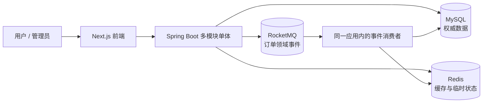
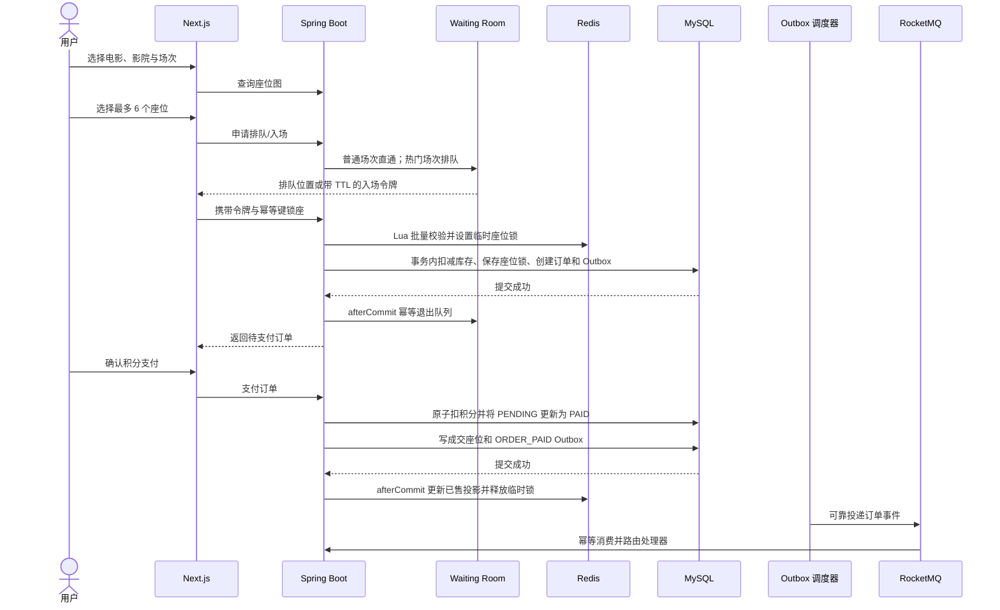

# 01. 项目总览

## 1. 项目定义

光影票务是一个面向电影查询、影院排片和在线购票的全栈交易系统。它不仅提供电影信息展示，还覆盖注册登录、场次查询、热门场次排队、在线锁座、订单创建、积分支付、订单取消和事件投递等完整链路。

项目的核心价值不在于页面数量，而在于围绕票务交易处理三个真实问题：

1. 电影列表读多写少，如何减少热点数据反复访问数据库。
2. 热门场次瞬时请求集中，如何在入口削峰并避免座位超卖。
3. 订单事务提交后，如何可靠地把领域事件交给异步消费者。

## 2. 项目定位与范围

### 2.1 已实现范围

| 业务域 | 主要能力 | 关键实现 |
| --- | --- | --- |
| 身份与认证 | 邀请码注册、登录、JWT 鉴权、用户上下文 | BCrypt、登录责任链、拦截器链 |
| 内容查询 | 电影、影院、城市、场次、搜索、想看 | MyBatis-Plus、Biz 聚合、分页查询 |
| 热点读取 | 电影列表与详情缓存 | Caffeine + Redis 两级 Cache Aside |
| 流量治理 | 接口限流、热门场次排队、入场令牌 | AOP、策略/注册表、Redis ZSet、租约 |
| 票务交易 | 选座、锁座、建单、支付、取消、超时释放 | Redis Lua、条件更新、唯一索引、事务回调 |
| 事件投递 | 订单创建、定时超时检查、支付、取消事件 | Transactional Outbox、RocketMQ、幂等消费 |
| 管理能力 | 初始化热门场次、查看与重试死信 Outbox | 管理接口、基础角色校验 |

### 2.2 当前非目标

当前项目没有把以下能力包装成“已经完成”：

- 第三方支付渠道、退款、清结算和支付回调对账。
- 电影票二维码核销、短信通知与真实出票系统。
- 多机房容灾、分库分表、跨地域数据复制。
- 完整 RBAC 权限平台、审计后台和运营配置中心。
- 以独立进程部署的微服务体系。

这些能力适合作为后续演进方向，但不影响当前项目对缓存、并发交易和消息可靠性的完整展示。

## 3. 系统上下文



在本地默认启动模式中，数据库使用 H2，Redis 与 RocketMQ 可以通过降级配置绕过，方便演示基本功能。Docker 完整模式接入 MySQL、Redis 与 RocketMQ，用于验证缓存、排队、锁座和消息链路。

## 4. 三条核心技术主线

### 4.1 查询主线：降低热点回源

```text
请求
  -> Caffeine L1
  -> Redis L2
  -> 进程内 single-flight
  -> Redisson 分布式锁后二次检查
  -> MySQL 加载
  -> 回填 Redis 与 Caffeine
```

这条链路分别处理：

- 缓存穿透：短时缓存空值，避免不存在的数据持续回源。
- 缓存击穿：本地 single-flight 合并单实例并发，Redisson 锁协调多实例回源。
- 缓存雪崩：Redis TTL 加随机偏移，降低大量键同时失效概率。
- Redis 故障：查询路径允许降级到本地缓存或数据库，优先保证可用性。
- 多实例 L1 一致性：缓存变更通过 Redis Pub/Sub 通知其他实例失效本地副本。

### 4.2 交易主线：从削峰到数据库裁决

```text
AOP 接口限流
  -> Waiting Room 排队准入
  -> Redis Lua 原子批量锁座
  -> MySQL 条件扣减可售库存
  -> 座位唯一索引最终裁决
  -> 同事务创建订单与 Outbox 事件
```

不同机制承担不同职责：入口限流保护接口，Waiting Room 控制进入抢座链路的人数，Redis Lua 快速拒绝座位冲突，MySQL 条件更新保证库存不为负，唯一索引防止同一场次同一座位重复成交。

### 4.3 消息主线：保证订单事件最终可达

```text
订单数据库事务
  -> 写入 Outbox PENDING 事件
  -> 调度器条件抢占并设置发送租约
  -> 同步投递 RocketMQ
  -> SENT / 指数退避重试 / DEAD
  -> 消费端按 eventId 落库去重
  -> 命令/注册表路由事件处理器
```

Outbox 解决“订单已经提交，但 MQ 发送失败”的双写问题。系统采用 At-least-once 投递语义，因此生产端允许重复发送，消费端必须用 `processed_event` 唯一记录实现幂等。

## 5. 一次购票的完整路径



如果建单事务失败，事务回调会补偿释放本次 Redis 座位锁；如果用户不支付，建单事务同时落库的 `ORDER_TIMEOUT_CHECK` 会在支付截止时间由 RocketMQ 定时投递并触发关单。支付接口的懒过期和 MySQL 分批扫描分别处理边界竞争与漏消息。Redis 锁 TTL 是资源自释放保险，但订单状态仍必须由数据库 CAS 推进。

## 6. 数据权威边界

| 数据 | 权威位置 | Redis 的角色 |
| --- | --- | --- |
| 用户账号、密码摘要、积分 | MySQL | 限流状态或临时上下文 |
| 电影、影院、场次 | MySQL | 查询缓存 |
| 场次可售库存 | MySQL | 不作为最终库存账本 |
| 订单状态与金额 | MySQL | 可缓存的读取投影 |
| 座位成交结果 | `order_seat` / `seat_lock` 等数据库记录 | 临时锁与已售快速投影 |
| Waiting Room 队列与入场租约 | Redis | 业务临时状态，可重建或过期 |
| Outbox 与消费去重记录 | MySQL | 不承担可靠性账本 |

“Redis 只维护可重建投影”不代表 Redis 不重要。它承担高并发路径的快速裁决和削峰，但最终交易事实仍由数据库事务与唯一约束确认。

## 7. 运行模式

| 模式 | 数据库 | Redis | RocketMQ | 用途 |
| --- | --- | --- | --- | --- |
| 本地默认模式 | H2 | 可降级 | 可降级 | 快速演示、单元与集成测试 |
| Docker 完整模式 | MySQL | 启用 | 启用 | 验证完整中间件链路 |
| 生产化演进 | MySQL 高可用 | Redis 集群 | RocketMQ 集群 | 当前未完整交付，需要监控、迁移与容灾配套 |

## 8. 工程证据与性能口径

- 后端测试覆盖缓存、认证拦截、设计模式注册表、购票主流程、可靠性加固和座位缓存隔离等关键场景。
- 前端能够完成生产构建，并保留类型检查和代码检查入口。
- 压测脚本位于 [`load-tests`](../load-tests)，简历中的 `3000` 请求、`100` 并发、吞吐提升 `73.5%` 为同环境单实例 A/B 对比。

该压测数字说明“两级缓存对目标列表接口有效”，不能直接外推为线上 QPS、集群容量或全链路承载能力。正式容量评估仍需要固定硬件、真实 MySQL/Redis/RocketMQ、预热策略、数据规模、错误率和 P95/P99 等完整报告。

## 9. 当前局限与演进方向

| 当前局限 | 风险或影响 | 合理演进 |
| --- | --- | --- |
| 积分模拟支付 | 无法证明真实资金链路 | 接入支付网关、回调验签、支付单和日终对账 |
| 定时消息仍可能延迟、重复或丢失 | 订单可能晚关，消费者可能重复执行 | 统一 CAS 关单，支付懒过期 + 数据库扫描兜底并监控兜底命中量 |
| 管理权限较轻量 | 运营与审计能力有限 | RBAC、审计日志、敏感操作二次确认 |
| Schema 以脚本维护 | 版本迁移可追踪性不足 | Flyway/Liquibase 管理数据库变更 |
| 中间件集成测试有限 | 集群故障场景证据不足 | Testcontainers、故障注入、重复消息与主从切换测试 |
| 生产可观测性不足 | 难以量化队列、锁座、Outbox 健康度 | Micrometer、Prometheus、Grafana 与告警规则 |

## 10. 一分钟项目介绍

> 光影票务是我独立设计并实现的电影购票交易系统，覆盖电影和影院查询、热门场次排队、在线锁座、订单创建与积分支付。查询侧使用 Caffeine 和 Redis 两级 Cache Aside，并通过空值缓存、随机 TTL、本地 single-flight 和 Redisson 分布式锁分别治理缓存穿透、雪崩和击穿。交易侧把链路拆成入口限流、Waiting Room 准入、Redis Lua 原子锁座、MySQL 条件更新和唯一索引五层防线，以数据库作为最终权威。消息侧使用 Transactional Outbox 与 RocketMQ，把订单和事件同事务落库，再通过发送租约、失败重试和消费端事件 ID 去重实现 At-least-once 下的最终一致性。项目当前采用多模块单体，既保留清晰边界，也控制了校招项目的部署复杂度。

## 11. 关键代码入口

- Web 接口：[`backend/provider/src/main/java/com/guangying/provider/controller`](../backend/provider/src/main/java/com/guangying/provider/controller)
- 交易链路：[`SeatService.java`](../backend/service/src/main/java/com/guangying/service/SeatService.java)、[`PaymentService.java`](../backend/service/src/main/java/com/guangying/service/PaymentService.java)
- 多级缓存：[`MultiLevelCacheService.java`](../backend/service/src/main/java/com/guangying/service/cache/MultiLevelCacheService.java)
- 排队准入：[`QueueService.java`](../backend/service/src/main/java/com/guangying/service/infrastructure/QueueService.java)
- 消息可靠性：[`OutboxService.java`](../backend/service/src/main/java/com/guangying/service/infrastructure/OutboxService.java)
- 消费路由：[`OrderEventHandlerRegistry.java`](../backend/service/src/main/java/com/guangying/service/mq/handler/OrderEventHandlerRegistry.java)
