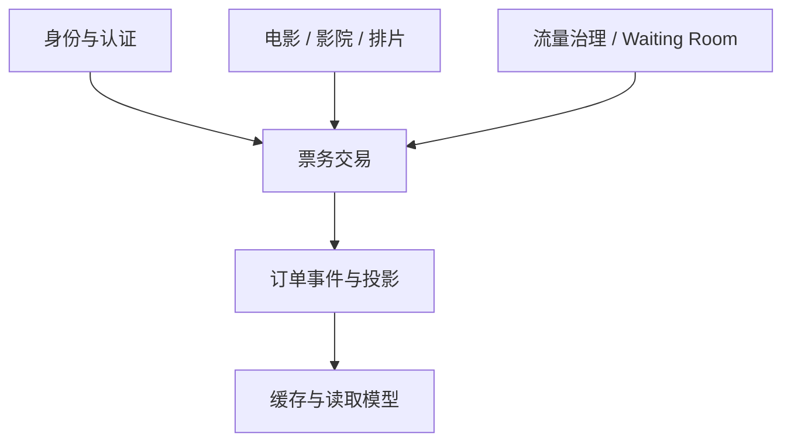
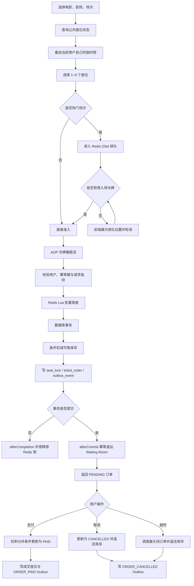
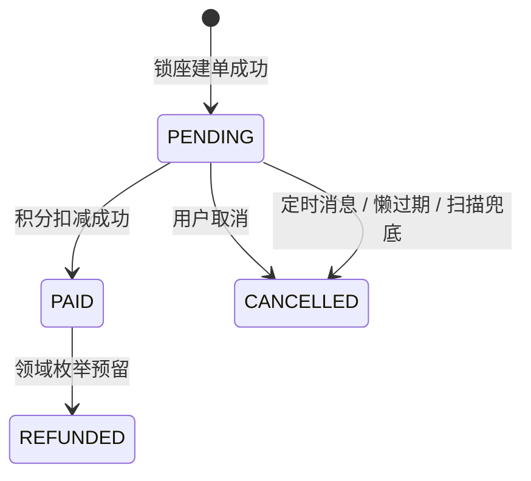
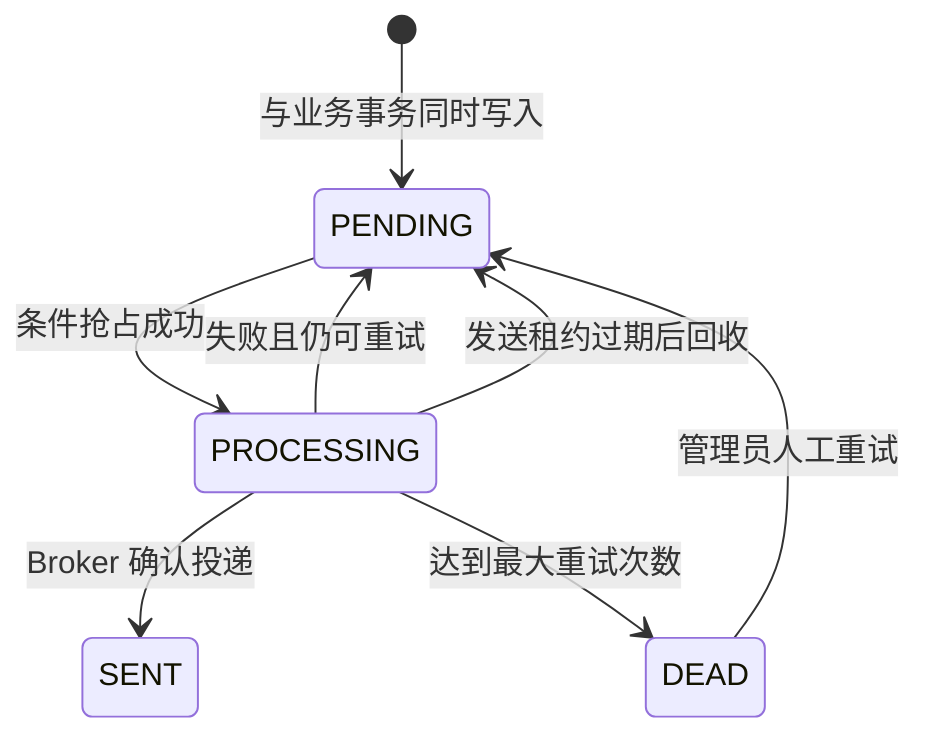
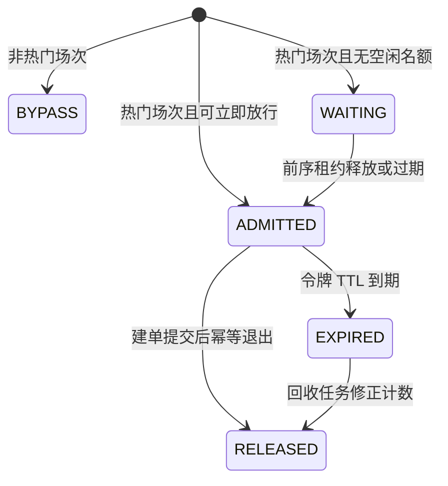

# 02. 业务与领域模型

## 1. 参与者

| 参与者 | 目标 | 主要动作 |
| --- | --- | --- |
| 游客 | 浏览电影信息 | 查看电影、影院、场次与搜索结果 |
| 注册用户 | 完成购票 | 登录、想看、排队、锁座、建单、支付、取消 |
| 管理员 | 管理热点流量与异常事件 | 初始化热门场次、查看和重试 DEAD Outbox |
| 系统调度器 | 推进后台流程 | 回收过期入场租约、投递 Outbox、扫描漏网超时订单 |
| MQ 消费者 | 应用订单领域事件 | 幂等登记事件并调用对应事件处理器 |

管理员与 MQ 消费者当前仍运行在同一个应用中。“参与者”是业务职责划分，不代表独立服务。

## 2. 业务子域

### 2.1 身份与认证

负责邀请码注册、密码摘要、登录校验、JWT 签发与请求用户上下文。登录流程通过责任链拆分参数校验、访问频率、用户加载和密码验证，使每个步骤可以独立扩展与测试。

### 2.2 内容与排片

负责电影、影院、影厅、城市和场次的查询。电影列表与详情属于典型读多写少数据，适合通过两级缓存降低数据库读取压力。

### 2.3 排队与准入

普通场次直接通过；被管理员标记为热门的场次进入 Waiting Room。Waiting Room 的目标不是永久拒绝用户，而是控制同一时刻进入昂贵锁座链路的人数。

### 2.4 票务交易

负责座位临时占用、订单创建、积分支付、取消和超时关闭。数据库事务、条件更新和唯一约束共同保护最终一致性，Redis 提供前置冲突过滤和临时租约。

### 2.5 领域事件

负责把订单创建、超时检查、支付和取消事件可靠交给异步处理器。Outbox 是数据库中的可靠投递账本，RocketMQ 是普通/定时消息传输通道，`processed_event` 是消费端幂等凭证。

## 3. 核心领域对象

| 对象 | 关键属性 | 主要职责 | 权威存储 |
| --- | --- | --- | --- |
| 用户 `User` | 账号、密码摘要、角色、积分 | 身份、权限与支付余额 | MySQL |
| 电影 `Movie` | 名称、上映状态、评分 | 内容展示与检索 | MySQL |
| 影院/影厅 `Cinema/Hall` | 区域、品牌、服务、座位布局 | 场地和座位空间定义 | MySQL |
| 场次 `Schedule` | 电影、影厅、时间、票价、可售数 | 一次可售放映资源 | MySQL |
| 入场租约 `Admission Lease` | 用户、场次、令牌、到期时间 | 限制进入锁座链路的并发数 | Redis |
| 座位锁 `Seat Lock` | 场次、行列、用户、订单、到期时间 | 表示未支付的临时占用 | MySQL + Redis 临时投影 |
| 订单 `Order` | 订单号、用户、场次、金额、状态、幂等键 | 承载购票交易状态 | MySQL |
| 成交座位 `Order Seat` | 订单、场次、行列、价格 | 记录已支付座位事实 | MySQL |
| Outbox 事件 | 事件 ID、类型、载荷、状态、重试信息 | 可靠投递账本 | MySQL |
| 已处理事件 | 事件 ID、处理时间 | 消费端幂等凭证 | MySQL |

## 4. 购票主流程

### 4.1 流程图

### 4.2 为什么先排队再锁座

Waiting Room 保护的是后面的 Redis Lua、数据库事务和唯一索引链路。如果所有用户在开售瞬间都直接执行锁座，即使数据库最终不会超卖，中间件连接池和数据库锁竞争仍可能先被打满。

用户进入 Waiting Room 后有三种体验：

- 普通场次：接口返回直通状态，前端直接进入选座或提交锁座。
- 热门场次且已有容量：立即获得带 TTL 的入场令牌。
- 热门场次容量已满：前端展示排队位置并轮询；队列已达上限时明确拒绝，而不是伪造已准入状态。

## 5. 三种“占用”的区别

### 5.1 排队位置

排队位置只表示“等待进入锁座链路”，不占用任何座位。用户离开或等待信息过期，不会影响库存。

### 5.2 入场租约

入场令牌是一张短期通行证，用来控制同时执行锁座的人数。它也不代表座位已经保留。令牌带 TTL；后台回收任务会移除过期租约、减少占用计数并晋升下一位用户。

### 5.3 座位临时锁

Redis Lua 锁座成功后，其他用户暂时不能选择同一座位。锁默认有 15 分钟 TTL，用户完成支付后转为已售；取消、超时或建单失败时提前释放。用户“点亮座位但尚未提交锁座”只是前端选择，不影响其他用户；只有后端锁座成功才形成临时占用。

## 6. 业务状态机

### 6.1 订单状态

当前公开链路重点实现 `PENDING -> PAID` 与 `PENDING -> CANCELLED`。`REFUNDED` 在领域枚举中预留，但项目没有把第三方退款流程描述为已完成能力。超时订单当前同样落到 `CANCELLED`，没有独立的 `CLOSED` 状态。

### 6.2 Outbox 状态

`PROCESSING` 不是永久锁。记录包含抢占令牌和租约截止时间，应用在发送后崩溃时，其他实例能够在租约过期后重新抢占。

### 6.3 Waiting Room 状态

## 7. 必须保持的业务不变量

这些规则比具体技术实现更重要：

1. 同一场次、同一行列的座位最多只能有一条有效成交记录。
2. 场次可售库存不能小于零。
3. 一次锁座请求最多包含 6 个座位，且必须作为一个批次全部成功或全部失败。
4. 同一用户的同一幂等键只能对应同一份请求内容；幂等键复用但请求指纹不同必须拒绝。
5. 只有订单所属用户才能支付或取消订单。
6. 只有 `PENDING` 订单允许进入支付或取消分支。
7. 支付成功必须同时满足积分足够、积分原子扣减成功和订单状态条件更新成功。
8. 建单事务回滚后，不能残留阻塞其他用户的 Redis 幽灵锁。
9. Waiting Room 的退出必须幂等，重复调用不能重复减少入场计数。
10. MQ 重复投递不能造成业务副作用重复执行。

## 8. 一致性边界

### 8.1 强一致事务内

同一个 MySQL 事务内完成的内容包括：

- 建单：条件扣减库存、数据库座位锁、订单、ORDER_CREATED 与 ORDER_TIMEOUT_CHECK Outbox。
- 支付：积分扣减、订单状态更新、成交座位、座位锁状态、ORDER_PAID Outbox。
- 取消/超时：订单状态更新、库存返还、座位释放记录、ORDER_CANCELLED Outbox。

这些写入要么一起提交，要么一起回滚。

### 8.2 最终一致事务外

以下动作发生在事务提交之后或由后台异步推进：

- 退出 Waiting Room。
- 更新 Redis 已售座位投影。
- 释放 Redis 临时座位锁。
- Outbox 投递 RocketMQ。
- 消费者更新派生数据或执行后续动作。

它们不能反过来决定数据库事务是否成功，因此通过 `afterCommit`、补偿、过期回收、重试和幂等恢复一致。

## 9. 典型异常场景

| 场景 | 当前处理 |
| --- | --- |
| Redis 座位锁成功，数据库事务失败 | 事务完成回调释放本次 Redis 锁 |
| 数据库订单已提交，进程未退出排队 | 入场租约 TTL + 回收任务兜底；退出操作本身幂等 |
| 用户重复提交锁座 | 用户 + 幂等键查询、请求指纹校验、数据库唯一索引 |
| 两个用户同时购买同一座位 | Lua 前置冲突校验，数据库座位唯一索引最终裁决 |
| 场次库存不足 | MySQL 条件更新失败，事务回滚并释放 Redis 锁 |
| 支付请求重复到达 | 订单状态条件更新，只允许 `PENDING -> PAID` |
| MQ 已收到消息，但 Outbox 未标 SENT 前进程崩溃 | 重新发送；消费者按事件 ID 幂等去重 |
| 消费者执行后未成功应答 | Broker 重投；`processed_event` 阻止重复副作用 |

## 10. 关键数据约束

| 约束 | 目的 |
| --- | --- |
| `ticket_order(user_id, idempotency_key)` 唯一 | 防止同一用户重复建单 |
| `seat_lock(schedule_id, row, col)` 唯一 | 防止同一场次座位重复占用 |
| `order_seat(schedule_id, row, col)` 唯一 | 防止同一场次座位重复成交 |
| `user_wish(user_id, movie_id)` 唯一 | “想看”操作幂等 |
| `processed_event(event_id)` 唯一 | 消费端事件去重 |

应用层校验用于提供更快、更友好的失败响应，数据库唯一约束才是并发竞争下的最后防线。

## 11. 关键代码入口

- 锁座建单：[`SeatService.java`](../backend/service/src/main/java/com/guangying/service/SeatService.java)
- 支付和取消：[`PaymentService.java`](../backend/service/src/main/java/com/guangying/service/PaymentService.java)
- 订单查询与超时处理：[`OrderService.java`](../backend/service/src/main/java/com/guangying/service/OrderService.java)
- Waiting Room：[`QueueService.java`](../backend/service/src/main/java/com/guangying/service/infrastructure/QueueService.java)
- Lua 座位锁：[`SeatLockScriptService.java`](../backend/service/src/main/java/com/guangying/service/infrastructure/SeatLockScriptService.java)
- Outbox：[`OutboxService.java`](../backend/service/src/main/java/com/guangying/service/infrastructure/OutboxService.java)
- 订单状态：[`OrderStatusEnum.java`](../backend/domain/src/main/java/com/guangying/domain/enums/OrderStatusEnum.java)
- 锁座请求：[`LockSeatsDTO.java`](../backend/domain/src/main/java/com/guangying/domain/model/dto/LockSeatsDTO.java)
