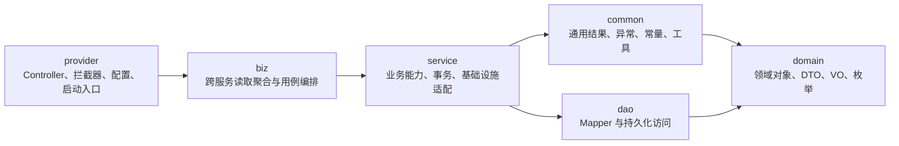
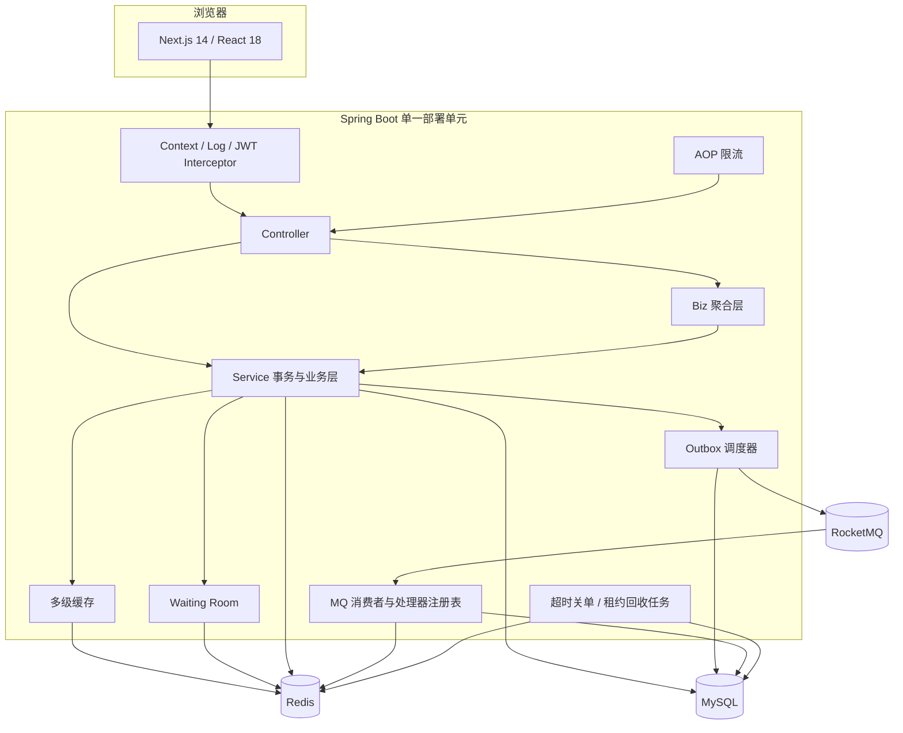
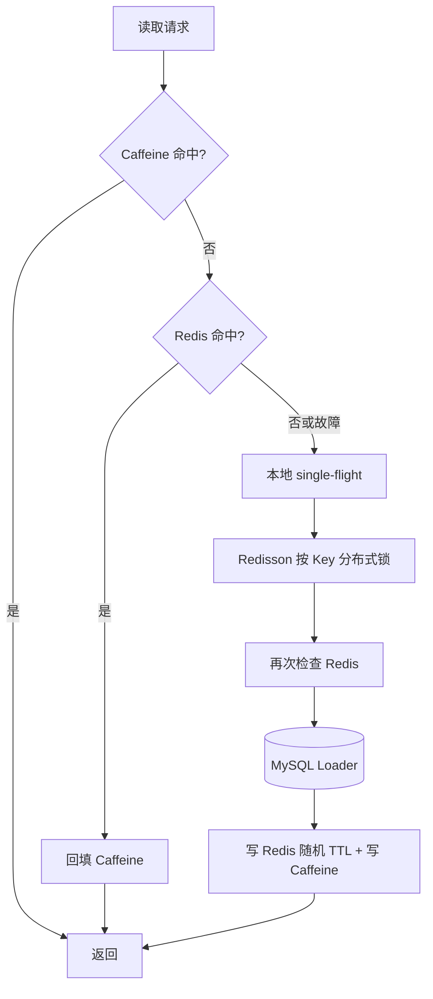
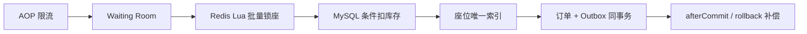

# 03. 系统架构

## 1. 架构风格

项目采用 **前后端分离 + 多模块单体 + 关系数据库权威存储 + Redis 临时投影 + RocketMQ 异步事件** 的架构。

选择多模块单体而不是直接拆微服务，原因是：

- 购票、库存、积分和订单仍需要紧密的本地事务边界。
- 当前团队规模和业务规模不需要承担服务发现、网关、链路追踪和分布式事务的额外成本。
- Maven 模块已经能表达依赖方向，保留未来按业务边界拆分的可能。
- 一个部署单元便于校招项目本地运行、测试和演示。

模块化解决“代码职责边界”，微服务解决“独立部署和团队协作边界”，两者不是同一个问题。

## 2. 代码模块



### 2.1 模块职责

| 模块 | 应该负责 | 不应该负责 |
| --- | --- | --- |
| `domain` | PO、DTO、VO、枚举、领域数据结构 | Controller、数据库访问、中间件调用 |
| `common` | 统一响应、异常、常量、通用工具 | 具体购票业务编排 |
| `dao` | Mapper、SQL 和持久化操作 | HTTP、缓存、跨用例事务编排 |
| `service` | 可复用业务能力、事务边界、缓存/Redis/MQ 适配 | Web 参数展示和页面模型拼装 |
| `biz` | 跨 Service 的用例编排、并行聚合、视图装配 | 直接访问 Mapper 或承担基础设施细节 |
| `provider` | HTTP 入口、鉴权、拦截器、配置、异常映射 | 直接写 SQL 或堆积核心交易规则 |

### 2.2 当前实现的真实边界

当前 `MovieListBiz`、`MovieDetailBiz` 和 `CinemaListBiz` 主要负责查询聚合；锁座、订单和支付等事务用例仍集中在 `service`。同时，`provider` 通过 `biz` 的传递依赖能够直接引用 `service`，所以 Maven 依赖图并没有完全禁止 Controller 直接调用 Service。

这不是微服务式的强隔离。更严格的演进方式包括：

- 为所有应用用例建立明确的 Biz/Application Service 门面。
- 禁止 `provider` 编译期访问具体 Service，只暴露用例接口。
- 使用 ArchUnit 测试依赖规则，持续阻止反向依赖和越层访问。
- 当模块需要独立扩缩容或独立数据所有权时，再评估拆服务。

## 3. 运行时组件



图中 Controller 同时调用 Biz 和 Service 是当前代码事实，而不是理想化隐藏。查询聚合优先经过 Biz，事务链路目前由 Service 暴露用例方法。

## 4. 请求处理链

### 4.1 通用 HTTP 请求

```text
Next.js / API Client
  -> RequestContextInterceptor：建立请求上下文
  -> RequestLogInterceptor：记录请求与耗时
  -> JwtAuthInterceptor：解析 JWT、建立用户身份
  -> Controller：协议转换与参数校验
  -> Biz 或 Service：用例编排与业务规则
  -> Mapper / Redis / RocketMQ：基础设施交互
  -> GlobalExceptionHandler：统一错误响应
```

登录接口内部还有一条责任链：

```text
请求参数校验
  -> 登录频率校验
  -> 用户查询与账号状态检查
  -> BCrypt 密码验证
  -> JWT 签发
```

### 4.2 锁座请求

锁座入口在通用链路前后增加交易保护：

```text
JWT 用户身份
  -> AOP 令牌桶限流
  -> Waiting Room 入场令牌校验
  -> 进程/分布式互斥与幂等检查
  -> Redis Lua 批量座位锁
  -> MySQL 本地事务
  -> TransactionSynchronization 提交后动作或回滚补偿
```

## 5. 数据与一致性架构

### 5.1 数据分类

| 分类 | 示例 | 一致性要求 | 实现策略 |
| --- | --- | --- | --- |
| 交易事实 | 订单、积分、库存、成交座位 | 强一致 | MySQL 本地事务、条件更新、唯一索引 |
| 查询缓存 | 电影列表、详情、影院数据 | 允许短暂不一致 | Cache Aside、TTL、失效通知 |
| 并发租约 | 入场令牌、Redis 座位锁 | 有界时间内有效 | TTL、回收任务、事务补偿 |
| 异步事件 | 订单创建/支付/取消 | 最终一致 | Outbox、重试、消费幂等 |
| 读取投影 | Redis 已售座位集合 | 可重建 | afterCommit 更新、事件修复、数据库兜底 |

### 5.2 为什么不用分布式事务

当前业务数据集中在同一个 MySQL 中，核心交易可以用本地事务完成。Redis 和 RocketMQ 不进入数据库事务：

- Redis 失败通过回滚补偿、提交后更新、TTL 和重建处理。
- MQ 双写通过 Transactional Outbox 转换为“同库订单 + 事件”的本地事务。
- 消费端接受 At-least-once，使用事件 ID 唯一记录去重。

这样避免引入 XA 或复杂的分布式事务协调器，同时明确接受短暂的投影不一致。

## 6. 关键设计模式与变化点

| 模式/思想 | 代码落点 | 变化点 | 带来的价值 |
| --- | --- | --- | --- |
| 模板方法思想 | `MultiLevelCacheService#get(key, loader)` | 不同数据的数据库加载方式 | 固定两级缓存骨架，调用方只提供 Loader |
| 策略 + 注册表 | 限流策略注册表 | 滑动窗口、令牌桶算法 | 注解选择算法，新增策略不修改核心路由 |
| 责任链 | 登录 Handler 链 | 登录前置校验步骤 | 单一职责，可插拔、可测试 |
| 命令 + 注册表 | 订单事件 Handler Registry | CREATED/TIMEOUT_CHECK/PAID/CANCELLED | 消费路由与处理逻辑解耦 |
| Cache Aside | Caffeine + Redis + MySQL | 读多写少查询 | 降低数据库负载并支持故障降级 |
| Transactional Outbox | 订单事务与 Outbox 调度器 | 数据库与 MQ 双写 | 把瞬时发送失败转换为可恢复状态 |
| 事务同步回调 | 锁座、支付后的 Redis 动作 | 数据库提交结果 | 避免事务回滚但 Redis 已提前更新 |

设计模式只应用在真实变化点。比如数据库唯一索引是并发约束，不需要包装成设计模式；Outbox 是一致性模式，也不应与 GoF 模式混为一谈。

## 7. 并发与异步模型

### 7.1 请求线程内并发

电影相关聚合使用 `CompletableFuture` 并行加载可以独立执行的数据，缩短串行等待时间。并行化只适合没有顺序依赖的查询，不能把同一数据库事务中的库存、订单和 Outbox 写入拆到不同线程。

### 7.2 后台调度

| 任务 | 目标 | 可靠性边界 |
| --- | --- | --- |
| Outbox 扫描 | 抢占并投递待发送事件 | 条件抢占、发送租约、指数退避、DEAD |
| 超时定时消息 | 到支付截止时间触发关单 | 专用 DELAY Topic、消费幂等、订单状态 CAS |
| 超时订单扫描 | 补偿漏消息和 Broker 故障积压 | 组合索引、分批排水、每单独立事务 |
| Waiting Room 回收 | 回收过期入场租约并晋升队列 | Redis 租约集合、幂等退出 |

### 7.3 MQ 消费

生产者、Broker 和消费者分别是：

- 生产者：应用中的 `OutboxService` 调度发送逻辑。
- Broker：RocketMQ，负责保存与投递消息。
- 消费者：同一 Spring Boot 应用中的订单事件消费者。
- 路由器：`OrderEventHandlerRegistry`，按事件类型选择处理器。
- 幂等账本：MySQL `processed_event` 表。

即使生产者与消费者当前在同一个部署单元内，MQ 仍然用于解耦提交事务和异步副作用；未来拆服务时可以迁移消费者而不改变 Outbox 语义。

## 8. 缓存架构



两级缓存不是简单地“多放一份”：Caffeine 负责进程内极低延迟，Redis 负责跨实例共享；single-flight 只合并单实例请求，Redisson 才协调多实例回源。两者职责互补。

## 9. 交易架构



这是一组逐层收紧的防线：

- AOP 限流控制单用户或单接口速率。
- Waiting Room 控制热门场次同时入场人数。
- Lua 保证多个座位的“先校验、再写锁”原子执行。
- 条件更新保证库存不会被扣成负数。
- 唯一索引对具体座位做最终并发裁决。
- 事务回调在数据库结果确定后再推进 Redis 投影。

## 10. 部署拓扑

### 10.1 本地演示

```text
Next.js dev server
    -> Spring Boot
        -> H2
        -> Redis/MQ 降级或关闭
```

适合快速启动和验证页面、接口及数据库事务，不用于证明完整中间件可靠性。

### 10.2 Docker 完整环境

```text
Browser
  -> Frontend / reverse proxy
  -> Spring Boot provider
  -> MySQL
  -> Redis
  -> RocketMQ NameServer + Broker
```

当前仍是单应用实例的教学与验证拓扑。要部署多实例，需要进一步确认本地缓存失效广播、调度任务抢占、共享 JWT 密钥、日志追踪和负载均衡配置。

## 11. 主要架构决策

| 决策 | 选择 | 放弃或延后 | 原因 |
| --- | --- | --- | --- |
| 服务形态 | 多模块单体 | 直接微服务化 | 保留本地事务，降低部署和运维成本 |
| 权威数据 | MySQL | Redis 作为最终库存 | 事务、条件更新、约束和审计能力更适合交易事实 |
| 热点治理 | 限流 + Waiting Room | 所有请求直接抢数据库锁 | 在昂贵链路前削峰 |
| 座位冲突 | Lua 前置 + DB 最终裁决 | 仅依赖 Redis 锁 | Redis 可丢失或过期，数据库必须兜底 |
| 消息一致性 | Transactional Outbox | 业务提交后直接发 MQ | 避免数据库成功、消息丢失的窗口 |
| 超时订单 | 定时消息主触发 + 懒过期 + DB 扫描兜底 | 只依赖消息或只依赖轮询 | 消息降低平均关单延迟，扫描保证最终收敛，CAS 防重复返库存 |
| 投递语义 | At-least-once + 幂等 | 追求不现实的端到端 exactly-once | 重复可治理，丢失更难恢复 |

## 12. 架构风险与约束

1. `provider` 对 `service` 的直接可见性会让 Biz 边界逐渐空心化，需要用接口或 ArchUnit 固化规则。
2. Caffeine 是实例私有状态；Pub/Sub 失效消息丢失时仍依赖短 TTL 收敛。
3. Redis 运行时故障时，查询链路可以降级，但 Waiting Room 与锁座链路必须谨慎失败，不能伪造准入或锁座成功。
4. 定时消息 Topic 必须显式创建为 DELAY 类型；兜底扫描仍需合理索引和批次，否则会形成数据库压力。
5. Outbox 只能保证事件可投递，业务副作用是否正确仍取决于消费端事务和幂等设计。
6. 当前积分支付适合展示条件更新与事务，不代表具备真实支付系统的安全与合规能力。

## 13. 目录与代码映射

| 架构元素 | 目录 |
| --- | --- |
| 前端 | [`frontend`](../frontend) |
| 领域对象 | [`backend/domain`](../backend/domain) |
| 公共能力 | [`backend/common`](../backend/common) |
| 数据访问 | [`backend/dao`](../backend/dao) |
| 业务与基础设施 | [`backend/service`](../backend/service) |
| 查询聚合 | [`backend/biz`](../backend/biz) |
| Web 入口与配置 | [`backend/provider`](../backend/provider) |
| 数据库脚本 | [`H2 Schema`](../backend/provider/src/main/resources/schema.sql)、[`MySQL 初始化与迁移`](../docker/mysql) |
| 压测脚本 | [`load-tests`](../load-tests) |
| 容器编排 | [`docker-compose.yml`](../docker-compose.yml) |

## 14. 后续拆分微服务的判断标准

不要仅因为“模块多”就拆服务。至少满足以下一项时才值得评估：

- 某个业务域需要独立扩缩容，例如查询流量远高于交易流量。
- 不同团队需要独立发布，并能承担接口兼容与运维责任。
- 数据所有权可以明确拆开，不再依赖跨域本地事务。
- 故障隔离收益明显大于网络、消息、观测和一致性成本。

如果未来拆分，较自然的候选边界是内容查询、排片、流量准入、票务交易和通知/事件投影。订单、库存和支付在没有成熟 Saga/补偿与对账能力前，不应为了形式强行拆散。
