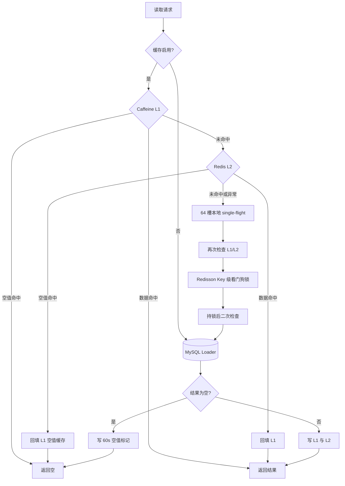
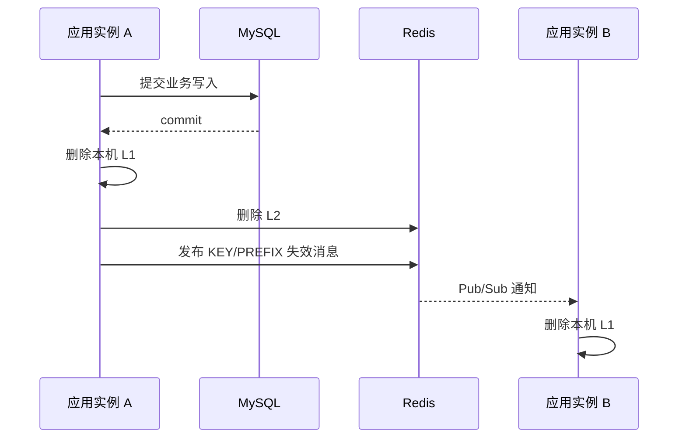

# 04. 缓存体系设计

## 1. 目标与适用范围

电影列表、电影详情、影院和排片属于典型的读多写少数据。缓存体系的目标是降低重复数据库查询和网络开销，同时在 Redis 故障或缓存失效时仍允许查询完成。

缓存不是所有数据的默认归宿。订单、积分、库存和座位成交结果仍以 MySQL 为准；Redis 只保存查询副本和可重建投影。

## 2. 整体结构



核心入口是 `MultiLevelCacheService#get(key, loader)`。它固定缓存读取、并发回源和回填骨架，调用方只提供数据库加载函数 `loader`。这是模板方法思想的应用：稳定流程被封装，可变的数据加载策略通过回调注入。

## 3. 两级缓存职责

| 层级 | 当前参数 | 主要职责 | 局限 |
| --- | --- | --- | --- |
| L1 Caffeine | 最大 500 条，写入后 60 秒过期 | 进程内低延迟读取，减少 Redis 网络访问 | 多实例不共享，重启即丢失 |
| L2 Redis | 基准 10 分钟 + 0~2 分钟随机偏移 | 跨实例共享，承载更大数据量 | 网络和 Redis 故障会影响访问 |
| L1 长期缓存 | 最大 100 条，按小时过期 | 城市等极低频变化数据 | 当前只在进程内共享 |

L1 未命中、L2 命中后必须回填 L1，否则每次请求都会继续访问 Redis，两级缓存会退化成单级缓存。

## 4. 完整读取算法

```text
1. 缓存关闭时，直接执行 loader。
2. 查询 Caffeine 数据缓存；命中直接返回。
3. 查询 Caffeine 空值缓存；命中返回 null。
4. 查询 Redis；命中后识别普通值或内部空值标记，并回填对应 L1。
5. Redis 未命中或读取失败时，按 key 哈希进入 64 个本地重建锁之一。
6. 获得本地锁后再次检查缓存，吸收同实例前一个线程的回填结果。
7. Redisson 可用时，竞争 `cache:rebuild:{key}` 分布式锁。
8. 获得分布式锁后再次检查缓存，吸收其他实例的回填结果。
9. 仍未命中才执行 loader 访问数据库。
10. 非空结果写入 L1 和带随机 TTL 的 L2；空结果写入独立短 TTL 空值缓存。
```

本地锁采用固定 64 槽条带，而不是为每个 key 永久创建锁对象，避免锁映射本身无限增长。代价是不同 key 可能映射到同一槽而发生少量无关等待。

## 5. Redis 三大缓存问题

### 5.1 缓存穿透

**问题**：攻击者或错误客户端持续查询不存在的电影 ID，每次都穿过缓存访问数据库。

**当前方案**：

- 数据库返回 `null` 时，在 Redis 写入内部空值标记。
- Caffeine 使用独立的 `l1NullCache` 保存空值状态。
- 空值 TTL 为 60 秒，避免新数据创建后长期被旧空值遮挡。
- 内部标记使用保留字符串，业务数据不得使用该值。

**为什么没有使用 Bloom Filter**：当前数据规模和写入频率下，短 TTL 空值缓存实现更直接，并且不存在 Bloom Filter 误判和重建问题。如果未来存在海量离散 ID 攻击，可在空值缓存之前增加 Bloom Filter，但仍需保留空值缓存处理误判。

### 5.2 缓存击穿

**问题**：单个热点 key 过期时，大量并发请求同时回源数据库。

**当前方案**：

```text
同实例：ReentrantLock 条带合并请求
跨实例：Redisson Key 级锁协调回源
持锁之后：再次检查 L1/L2
真正未命中：仅一个请求执行 loader
```

本地 single-flight 和分布式锁不能互相替代：前者无需网络但只对单实例有效，后者能够协调多实例但依赖 Redis。缓存重建使用无显式租期的 Redisson 锁，允许 WatchDog 在数据库加载较慢时续约。

如果分布式锁等待 2 秒后仍未获得，代码会再次检查缓存；仍为空时为保证查询可用性而回源数据库。这意味着极端故障下系统选择“可能出现少量重复回源”，而不是让所有查询无限等待。

### 5.3 缓存雪崩

**问题**：大量 key 在相近时间同时过期，引发数据库瞬时流量峰值。

**当前方案**：

- Redis 基础 TTL 为 10 分钟。
- 每次写入额外增加 0~2 分钟随机偏移。
- L1 与 L2 使用不同过期周期，形成时间错层。
- Redis 故障时查询链路可回退到 L1 或数据库。

随机 TTL 只能分散自然过期，不能解决 Redis 整体宕机、批量误删或冷启动。生产环境仍需要 Redis 高可用、热点预热、数据库限流和容量保护。

## 6. 写入与失效策略

当前采用 Cache Aside：数据库负责权威写入，缓存作为旁路副本。



失效支持单 key 和前缀两种形式。前缀删除 Redis key 使用 `SCAN` 分批查找，而不是阻塞式 `KEYS`。

Pub/Sub 只负责加速多实例 L1 收敛，不提供可靠消息保证。如果某个实例离线或漏收通知，L1 最终仍会在自身 TTL 到期后收敛。因此该设计接受有界的短暂不一致。

## 7. 故障降级

| 故障 | 当前行为 | 取舍 |
| --- | --- | --- |
| Redis Bean 不存在 | 本地模式使用 L1 和数据库 | 便于 H2 演示，不验证分布式能力 |
| Redis 读取失败 | 记录告警并继续进入回源流程 | 查询可用性优先 |
| Redis 写入失败 | 返回数据库结果，L1 仍可使用 | 后续请求可能重复回源 |
| Redisson 获取异常 | 保留本地 single-flight，最终可直接回源 | 允许少量跨实例重复查询 |
| Pub/Sub 发布失败 | 本机已失效，其他实例等待 TTL 收敛 | 接受短暂旧值 |
| 数据库失败 | loader 异常向上传播 | 缓存未命中时无法伪造数据 |

缓存查询可以 fail-open，但交易锁座不能照搬这种策略。查询允许返回数据库结果，交易链路在 Redis 运行期故障时应拒绝锁座，避免把并发风险直接扩散到数据库。

## 8. 座位图缓存的隔离设计

座位图包含两类信息：

- 公共状态：可选、已售、被某个用户锁定。
- 用户私有状态：某个锁定座位是否由“当前用户”持有。

系统只把公共座位图缓存 5 秒。读取共享缓存后，再逐座检查当前用户的锁持有关系，把公共“已锁定”转换为“我已锁定”。这样可以避免用户 A 的私有状态被缓存后泄漏给用户 B。

已售集合 `seat:sold:{scheduleId}` 是 MySQL `order_seat` 的可重建投影。Redis 为空或读取失败时，`SeatSoldService` 会从数据库加载；支付事件也会触发投影重建。

## 9. 性能收益如何解释

简历中的结果是：在 `3000` 请求、`100` 并发、同环境单实例 A/B 压测中，电影列表接口吞吐提升 `73.5%`。

可信的解释方式是：

- 对照组关闭缓存，被测组开启同一份代码的数据缓存。
- 两组使用相同机器、JVM、数据集、并发和请求总量。
- 优化收益来自减少 MySQL 查询与对象装配，而不是 RocketMQ 或 Waiting Room。
- 该数据证明目标接口的相对改善，不代表线上极限容量。

完整报告还应记录平均延迟、P95/P99、错误率、预热状态、数据库连接池和 Redis 部署方式。

## 10. 当前边界与改进项

1. 条带锁会让哈希冲突的不同 key 串行，可按热点规模调整槽数或引入按 key 可回收 Future。
2. Pub/Sub 不可靠，强一致配置数据可改用版本号、消息日志或配置中心。
3. 前缀扫描虽然使用 `SCAN`，大规模 key 空间下仍应限制批次并避免高峰操作。
4. 缓存命中率、回源次数、重建等待时间和 Redis 异常尚需统一指标化。
5. 空集合与 Redis key 不存在目前都可能触发已售投影重建，可增加显式“已加载空集合”标记。

## 11. 关键代码

- [`MultiLevelCacheService.java`](../backend/service/src/main/java/com/guangying/service/cache/MultiLevelCacheService.java)
- [`CacheInvalidationConfiguration.java`](../backend/service/src/main/java/com/guangying/service/cache/CacheInvalidationConfiguration.java)
- [`DistributedLockService.java`](../backend/service/src/main/java/com/guangying/service/infrastructure/DistributedLockService.java)
- [`CacheConstants.java`](../backend/common/src/main/java/com/guangying/common/constants/CacheConstants.java)
- [`SeatSoldService.java`](../backend/service/src/main/java/com/guangying/service/infrastructure/SeatSoldService.java)
- [`SeatService.java`](../backend/service/src/main/java/com/guangying/service/SeatService.java)

## 12. 面试追问索引

- 为什么 L1 与 L2 TTL 不相同？
- 本地 single-flight 与 Redisson 分布式锁分别解决什么范围的问题？
- 获锁后为什么必须二次检查？
- Redis 故障时为什么查询放行、锁座拒绝？
- Pub/Sub 丢消息后缓存一致性如何收敛？
- 空值缓存与 Bloom Filter 如何选择？
- `SCAN` 是否绝对安全，为什么仍要控制执行时机？
