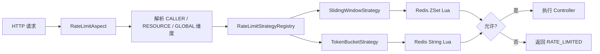
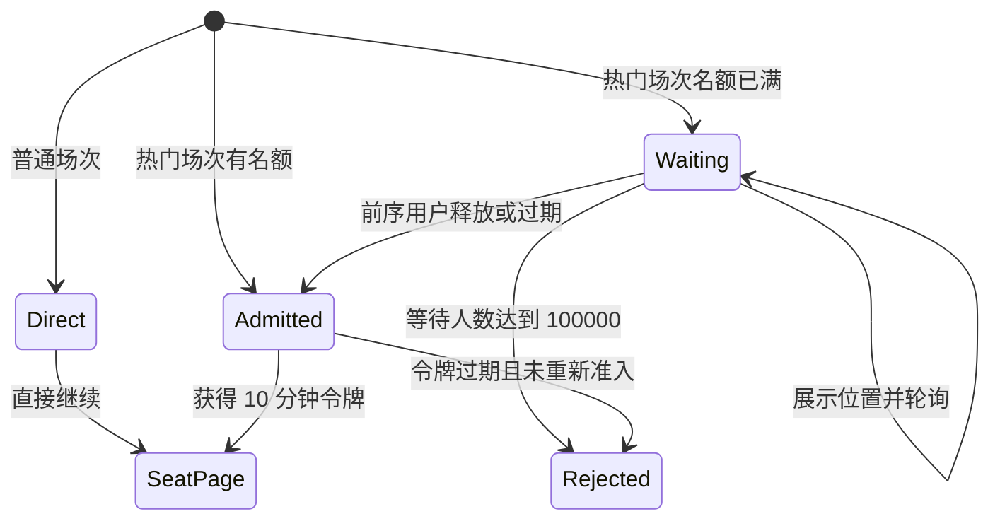
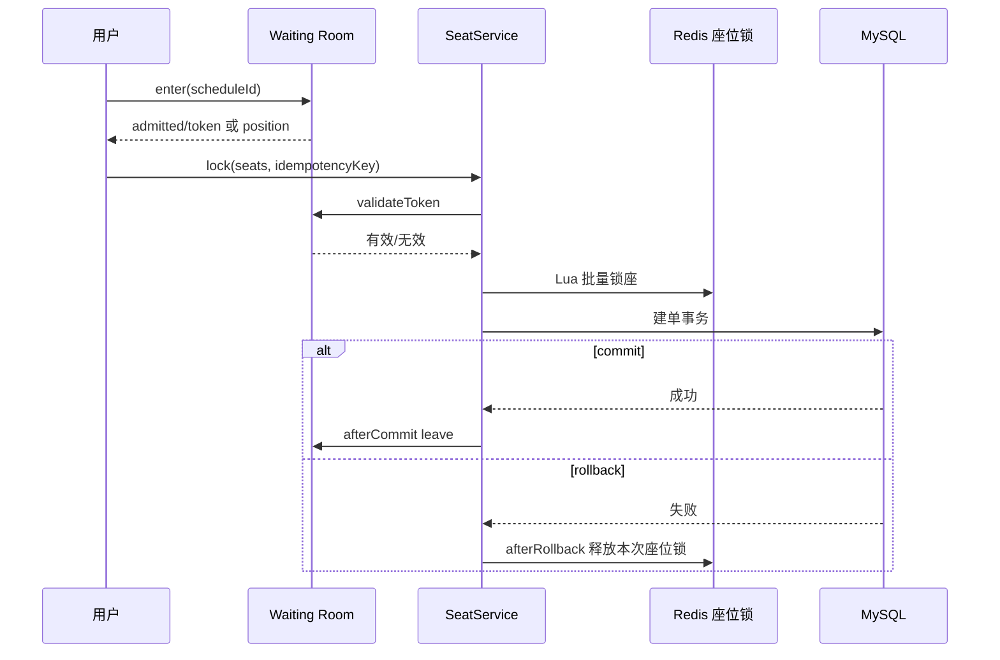

# 05. 流量治理与 Waiting Room

## 1. 为什么需要两层流量治理

接口限流和 Waiting Room 解决的不是同一个问题：

| 机制 | 控制对象 | 时间尺度 | 目标 |
| --- | --- | --- | --- |
| 滑动窗口/令牌桶 | 用户/IP、场次资源与应用全局 | 秒或分钟 | 防刷、隔离单热点并保护集群总容量 |
| Waiting Room | 某个热门场次同时进入交易链路的用户数 | 一次短期租约 | 削峰、保护锁座和数据库 |

一个用户没有超过令牌桶频率，不代表整个热门场次的总并发安全；反过来，进入排队系统也不能替代对恶意用户的接口级限流。

## 2. 四级防线中的位置

```text
第 1 层：AOP 组合限流             —— 用户/IP + 场次资源 + 应用全局
第 2 层：Waiting Room 排队准入    —— 控制场次级并发
第 3 层：Redis Lua 原子锁座       —— 快速裁决座位冲突
第 4 层：MySQL 条件更新 + 唯一索引 —— 最终库存与座位约束
```

前两层负责流量，后两层负责正确性。即使限流参数配置不合理，数据库仍不能超卖；但数据库正确不等于系统在洪峰下仍然可用，因此需要前置削峰。

## 3. 声明式限流

### 3.1 调用链



Controller 可以重复声明 `@RateLimit`。切面依次生成调用方、业务资源和全局 Key；RESOURCE 维度通过 SpEL 从 DTO 或方法参数提取 `scheduleId`。注册表再按枚举选择算法，新增算法时不需要修改切面的核心路由。

### 3.2 当前使用参数

| 接口 | 算法 | 维度 | 当前参数 |
| --- | --- | --- | --- |
| 锁座 `/api/seat/lock` | 令牌桶 | 用户 / 场次 / 全局 | `8/2s`、`400/120s`、`1200/400s` |
| 支付接口 | 令牌桶 | 用户 / 全局 | `6/2s`、`600/200s` |
| 场次查询 | 滑动窗口 | 用户或 IP / 全局 | `120/min`、`60000/min` |
| 想看操作 | 滑动窗口 | 用户 / 全局 | `30/min`、`30000/min` |
| Waiting Room 进入 | 令牌桶 | 用户 / 场次 / 全局 | `12/3s`、`20000/5000s`、`60000/15000s` |
| Waiting Room 状态 | 滑动窗口 | 用户 / 场次 / 全局 | `30/min`、`180000/min`、`600000/min` |

`8/2s` 表示桶容量 8、每秒补充 2 个令牌，而不是 8 秒。队列入口的场次级与全局阈值故意远高于锁座阈值：它们是保护排队基础设施的紧急保险丝，正常洪峰应进入队列，而不是在排队入口被过早拒绝。上述数值是集群化部署参考基线，不是本项目单机实测容量；上线前必须用目标硬件压测回标。

## 4. 两种限流算法

### 4.1 滑动窗口

Redis ZSet 的 score 使用请求时间戳，Lua 一次完成：

1. 删除窗口外记录。
2. 统计窗口内元素数。
3. 未达上限则加入本次请求。
4. 设置 key 过期时间。

优点是任意连续窗口内计数更准确，不会出现固定窗口边界突刺；缺点是每个请求保留一个 ZSet 成员，内存和操作成本高于简单计数器。

### 4.2 令牌桶

Redis 保存剩余令牌和上次补充时间。Lua 根据时间差计算新增令牌：

```text
current = min(capacity, lastTokens + elapsedSeconds * refillRate)
current >= 1：扣除 1 个并放行
current < 1：拒绝
```

令牌桶允许有限突发，同时控制长期平均速率，适合用户快速重试锁座或支付的场景。漏桶更适合要求严格匀速的下游，本项目没有实现漏桶。

### 4.3 故障策略

Redis Bean 不存在或限流 Lua 运行异常时，当前限流组件采用 fail-open，记录日志后放行。这保证普通接口在 Redis 故障时仍可访问，但也意味着限流保护消失。

锁座链路还有 Waiting Room、Lua 座位锁和数据库约束兜底；生产系统可进一步使用本地限流作为 Redis 故障降级，避免所有流量直达数据库。

## 5. Waiting Room 是什么

Waiting Room 不是“禁止进入”，而是把热门场次的用户分为：

- 等待者：留在 ZSet 队列，前端展示排队位置。
- 已准入者：拿到一张 10 分钟有效的入场令牌，可以调用锁座。
- 已离场者：建单成功、主动离开或令牌过期，释放一个准入名额。

普通场次没有 Waiting Room 开销。只有管理员调用 `/api/queue/admin/init-hot` 标记的热门场次才启用排队。

## 6. 参数与 Redis 数据结构

| 参数/Key | 当前值或含义 |
| --- | --- |
| `maxAdmission` | 默认 2000，可按场次覆盖，上限保护默认 20000 |
| `maxWaiting` | 默认 100000，可由 `QUEUE_MAX_WAITING` 调整 |
| 入场令牌 TTL | 600 秒，即 10 分钟 |
| 热门标记 TTL | 24 小时 |
| 租约回收周期 | 默认 5 秒 |
| 预计等待 | 每名前序用户按 30 秒估算，仅用于展示 |
| `queue:waiting:{scheduleId}` | 等待队列 ZSet，score 为入队时间 |
| `queue:lease:{scheduleId}` | 已准入租约 ZSet，score 为到期毫秒时间 |
| `queue:token:{scheduleId}:{userId}` | 锁座时快速校验的令牌 key |
| `queue:max:{scheduleId}` | 场次最大准入数 |

管理员只对预计出现开售洪峰的场次预热 Waiting Room；普通场次始终直通。热门场次前 2000 名用户可直接获得准入租约，超过后才开始排队。2000 是可配置的集群参考基线，不等于数据库能承受 2000 QPS：`maxAdmission` 控制活跃交互会话，场次级锁座令牌桶进一步把写入整形成长期约 120 次/秒。正式参数应依据锁座 P95、连接池、数据库写能力、转化率和超时率压测确定。

## 7. 用户看到的页面行为



排队中不是 HTTP 错误，接口返回 `admitted=false`、当前位置和预计等待时间，前端继续轮询。队列真正达到上限时才返回“队列已满”。Redis 运行期异常时返回“排队服务暂时不可用”，前端不能伪造已准入。

预计等待时间是简单启发式，不是 SLA。当前实现按前面的人数乘 30 秒估算，没有结合实际离场速率动态校正。

## 8. 原子入场流程

`ENTER_LUA` 在 Redis 内一次完成：

1. 清理当前场次已过期的租约和 token。
2. 如果租约数低于 `maxAdmission`，从等待队列头部补位。
3. 用户已有有效 token 时直接返回已准入，并修复租约记录。
4. 用户已在等待队列时返回当前排名，不重复入队。
5. 仍有准入容量时创建 token 和租约。
6. 无容量且等待队列已满时拒绝。
7. 否则按当前时间加入等待 ZSet。

Lua 避免多个应用实例同时判断“还有一个名额”后都放行，保证检查和写入是一个 Redis 原子操作。

## 9. 租约为什么必要

如果只给用户一个 TTL token，token 到期后 Redis 会自动删除，但系统没有事件通知去同步减少“当前入场人数”。结果是名额可能永久泄漏。

因此系统同时维护租约 ZSet：

- token key 用于锁座路径 O(1) 快速鉴权。
- lease ZSet 用于按到期时间扫描和回收容量。
- 5 秒回收任务删除过期租约并从 waiting ZSet 晋升下一批用户。

这是“令牌负责鉴权、租约负责资源生命周期”的分工。

## 10. 幂等离场

建单成功后，`afterCommit` 调用 `leave(scheduleId, userId)`。取消或超时流程可能再次调用离场，因此离场必须幂等。

`LEAVE_LUA` 只有在真正从 lease ZSet 删除到一条记录时，才释放容量并晋升下一位。如果重复调用时租约已经不存在，`released=0`，不会再次推进队列，也不会造成入场计数重复减少。

## 11. 与锁座事务的边界



入场令牌只代表“允许尝试锁座”，不保证目标座位一定可用。真正的座位竞争由 Lua 和数据库裁决。

## 12. 故障与边界

| 场景 | 当前行为 |
| --- | --- |
| 本地模式没有 Redis Bean | 普通演示直接放行，不具备真实排队能力 |
| Redis 运行时进入排队失败 | 返回服务不可用，不伪造准入 |
| Redis 运行时校验 token 失败 | 校验返回 false，拒绝锁座 |
| 用户关闭页面 | token 最多保留 10 分钟，由回收器释放 |
| 建单成功但离场回调失败 | TTL + lease reaper 最终回收 |
| 重复离场 | 只第一次删除租约并推进队列 |
| 热门标记 24 小时到期 | 场次恢复为普通直通，需要运营重新初始化 |
| 回收任务多实例同时运行 | Lua 原子操作避免同一等待者被重复晋升 |

当前 `isHotSchedule` 查询异常时会返回非热门，主要用于离场等辅助判断；关键的 `enter` 和 `validateToken` 路径在运行期 Redis 异常时分别抛错或拒绝。生产化时仍应对热门配置使用更可靠的持久化来源，避免热门标记本身仅依赖短期 Redis key。

## 13. 关键代码

- [`RateLimitAspect.java`](../backend/service/src/main/java/com/guangying/service/aspect/RateLimitAspect.java)
- [`RateLimiterService.java`](../backend/service/src/main/java/com/guangying/service/infrastructure/RateLimiterService.java)
- [`RateLimitStrategyRegistry.java`](../backend/service/src/main/java/com/guangying/service/ratelimit/RateLimitStrategyRegistry.java)
- [`QueueService.java`](../backend/service/src/main/java/com/guangying/service/infrastructure/QueueService.java)
- [`QueueController.java`](../backend/provider/src/main/java/com/guangying/provider/controller/QueueController.java)
- [`SeatController.java`](../backend/provider/src/main/java/com/guangying/provider/controller/SeatController.java)

## 14. 面试追问索引

- 为什么锁座同时需要用户、场次和全局三个令牌桶？
- 多条限流规则顺序执行时，后层拒绝为什么允许前层消耗一个令牌？
- 滑动窗口为什么使用 ZSet，member 如何避免同毫秒覆盖？
- 为什么进入 Waiting Room 后还需要接口限流？
- `maxAdmission` 应该怎样通过压测确定？
- token 自动过期后为什么还需要 lease ZSet？
- 离场为什么可能被调用多次，如何保证幂等？
- Redis 故障时限流、排队和锁座为什么采用不同降级策略？
