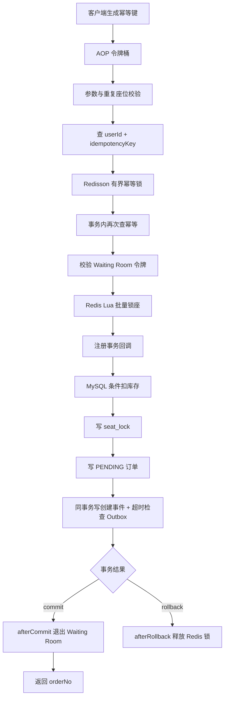
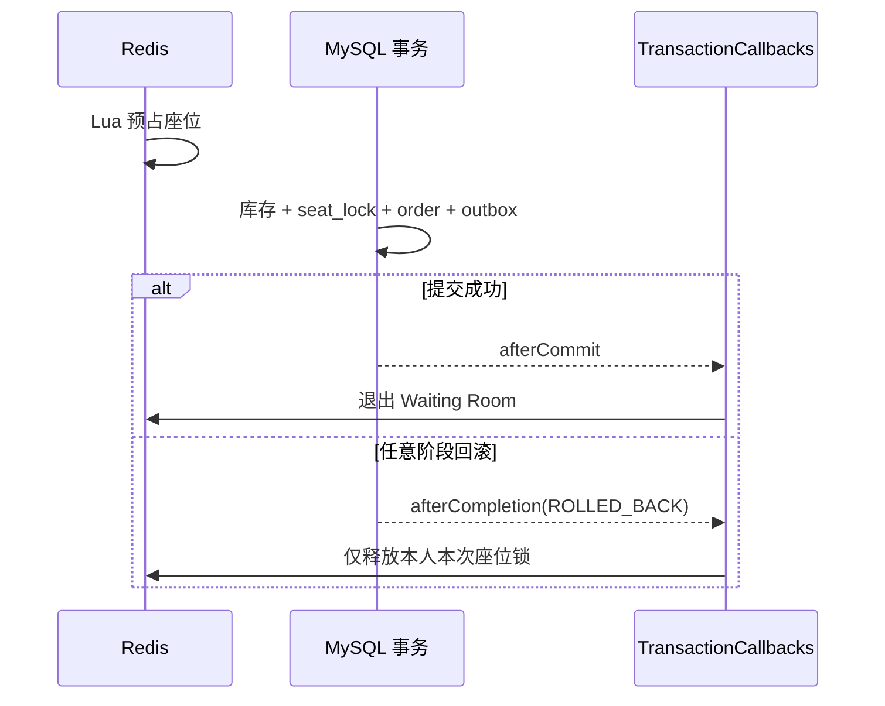
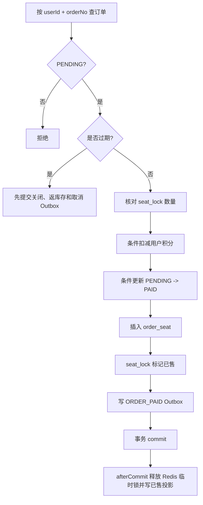

# 06. 锁座、订单与支付链路

## 1. 设计目标

购票链路需要同时满足：

- 同一个座位不能卖给两个人。
- 多座位订单必须整体成功或整体失败。
- 场次可售库存不能扣成负数。
- 网络重试不能重复建单、重复扣积分。
- 数据库回滚后不能遗留 Redis 幽灵锁。
- Redis 临时状态丢失时，数据库仍保留最终交易事实。

系统没有把正确性押在单一机制上，而是构建逐层收紧的防线。

## 2. 总体链路



## 3. 请求契约

锁座请求包含：

- `idempotencyKey`：客户端为一次购票意图生成，网络重试必须复用。
- `scheduleId`：目标场次。
- `seats`：1~6 个、行列均大于 0 的座位列表。

服务端首先把座位转换为 `row_col` 集合，拒绝请求体内部的重复位置。随后用“场次 ID + 排序后的座位集合”计算 SHA-256 请求指纹。

指纹解决一个容易忽略的问题：客户端可能错误地把同一幂等键用于另一场次或另一组座位。仅靠唯一索引会返回旧订单，指纹校验则明确返回冲突，防止静默串单。

## 4. 三层幂等

| 层级 | 机制 | 作用 |
| --- | --- | --- |
| 快速返回 | 先按用户和幂等键查询订单 | 已完成请求直接返回原订单 |
| 并发合并 | Redisson `order:idempotency:{userId}:{key}` 有界锁 | 降低同一请求并发进入事务的概率 |
| 最终约束 | `ticket_order(user_id, idempotency_key)` 唯一索引 | 锁失效或多实例竞争时仍只能插入一次 |

分布式锁等待 3 秒、最大租期 15 秒。这里使用有界租期而不是 WatchDog：如果持锁线程卡住，锁最终会释放，避免同一个购票意图被永久占用。即使租约提前到期，数据库唯一索引和请求指纹仍是最终防线。

## 5. Redis Lua 批量锁座

### 5.1 Key 设计

每个座位一个 key：

```text
seat:lock:{scheduleId}:{row}_{col} -> userId
TTL = 900 秒
```

单座独立 key 让不同座位可以并发竞争；一次 Lua 调用接收本次订单的全部座位 key。

### 5.2 两阶段脚本

```text
第一阶段：遍历全部 key
  - 发现任一座位被其他用户持有：返回 CONFLICT，不写任何 key
  - 发现任一座位已被本人持有：返回 ALREADY_OWNED，不刷新 TTL、不补写

第二阶段：仅当全部可用
  - 为每个座位写入 userId
  - 设置 15 分钟 TTL
  - 返回 ACQUIRED
```

“先完整预检、后统一写入”保证多座位原子性，不会出现 3 个座位只锁到 2 个的半成功状态。

`ALREADY_OWNED` 不直接视为成功，因为第一次请求可能仍在提交窗口中。业务层会查询已有待支付订单；查不到时返回“请求处理中”，而不是再次建单，也不会注册回滚补偿误删第一次请求的锁。

### 5.3 故障策略

- 本地 H2 模式没有 Redis Bean 时，允许退化为数据库唯一约束兜底。
- 完整环境中 Redis Lua 运行异常时返回 `UNAVAILABLE`，锁座 fail-closed。
- 不允许在 Redis 运行期故障时假装锁座成功，否则洪峰会绕过快速冲突过滤直接打向数据库。

## 6. MySQL 最终裁决

Redis 获锁不等于购票成功，事务内仍需通过数据库约束：

### 6.1 条件扣减库存

语义等价于：

```sql
UPDATE movie_schedule
SET available_seats = available_seats - :seatCount
WHERE id = :scheduleId
  AND available_seats >= :seatCount;
```

受影响行数为 0 表示库存不足。相比对场次整行使用乐观版本号，这种条件更新不会让购买不同座位的请求因为同一个版本号而大量互相冲突。

### 6.2 座位唯一约束

`seat_lock(schedule_id, row_num, col_num)` 唯一索引防止同一场次同一座位出现两条有效锁记录；支付后的 `order_seat` 还有相同维度的唯一索引，保护最终成交结果。

Redis 是前置裁决，数据库才是最后防线。即使 Redis 数据丢失、锁租约到期或应用绕过 Redis，数据库仍不能允许重复成交。

## 7. 建单事务

同一个 MySQL 事务中完成：

1. 校验场次存在、在售且未删除。
2. 条件扣减 `available_seats`。
3. 为每个座位插入 `seat_lock`，状态为锁定中。
4. 快照电影名、影院名、影厅、场次时间、单价和座位文本。
5. 创建 `PENDING` 订单并设置支付过期时间。
6. 创建 `ORDER_CREATED` 与 `ORDER_TIMEOUT_CHECK` 两条 Outbox 事件；后者携带绝对支付截止时间。

订单快照避免电影或影院名称后续变更影响历史订单展示。Outbox 和订单同事务写入，因此不存在“订单已成功但事件记录完全丢失”的提交窗口。

## 8. 事务回调与补偿

Redis 不参与 MySQL 事务。如果在事务提交前就退出队列或永久修改 Redis 投影，数据库回滚后会留下错误状态。

系统通过 `TransactionSynchronization` 注册：

- `afterCommit`：建单真正提交后，幂等退出 Waiting Room。
- `afterRollback`：释放本次请求新获得的 Redis 座位锁。



回调失败只记录错误，不能回滚已经提交的数据库事务。座位锁 TTL、Waiting Room 租约回收以及后续读时重建负责最终收敛。

## 9. 支付流程



积分扣减和订单状态推进都使用条件更新。支付接口叠加用户级容量 6、每秒补 2 与全局容量 600、每秒补 200 的令牌桶：前者防止客户端快速重复点击，后者保护支付处理集群；最终正确性仍由订单状态条件更新和幂等控制保证。

Waiting Room 名额已经由建单成功唯一释放，支付阶段不再重复 `leave`。这避免建单和支付两个阶段都减少计数造成过度放行。

## 10. 取消与超时

### 10.1 用户取消

只有本人 `PENDING` 订单可以取消。事务内条件关闭订单、返还场次库存、释放数据库座位锁并写 `ORDER_CANCELLED` Outbox；提交后释放 Redis 座位锁。

### 10.2 支付时懒过期

用户点击支付时如果订单已过期，系统先在当前事务中关闭订单并写 Outbox，再通过特定异常向用户返回“订单已过期”。该异常被配置为不回滚，从而保证释放逻辑真正提交。

### 10.3 RocketMQ 定时消息主触发

建单事务将 `ORDER_TIMEOUT_CHECK` 和订单一起写入 Outbox。Outbox 发送器从载荷读取 `deliverAtEpochMs`，向专用 `guangying_order_timeout` DELAY Topic 发送 RocketMQ 5 定时消息；若发送器在截止时间之后才恢复，则立即发送检查消息。

消费者到点后不直接“无条件取消”，而是再次读取 MySQL 并调用统一 `OrderCloseService`：仅当订单仍为 `PENDING` 且 `expire_time <= now` 时，才通过条件更新推进为 `CANCELLED`。已支付、已取消或重复到达的消息直接幂等结束；消息过早到达则抛错触发 Broker 重试，禁止提前关单。

### 10.4 数据库扫描兜底

后台每 60 秒按 `(status, deleted, expire_time, id)` 组合索引有序读取过期订单，默认每批 100 条、单轮最多 10 批。每个订单使用独立 `REQUIRES_NEW` 事务调用同一关单服务，避免一笔异常回滚整批，也缩小事务和锁范围。

扫描不是正常主路径，而是补偿消息遗漏、Broker 长时间不可用和恢复后的历史积压。兜底命中应记为异常健康信号；若持续升高，需要排查 DELAY Topic、消费积压或时钟偏差。

### 10.5 统一关单链路

用户取消、定时消息、支付懒过期和数据库扫描只负责“触发”，库存返还、数据库座位锁释放、`ORDER_CANCELLED` Outbox 与提交后的 Redis 清理只在 `OrderCloseService` 实现一次。`UPDATE ... WHERE status = PENDING` 是并发裁决点，因此支付与关单同时发生时只有一个状态迁移成功，也不会重复归还库存。

## 11. 座位图读取

座位图读取按以下顺序组装：

1. 读取最多缓存 5 秒的公共座位图。
2. 缓存未命中时读取影厅布局。
3. 从 Redis 已售投影获取成交座位；为空或故障时从 `order_seat` 重建。
4. 逐座检查 Redis 临时锁，公共视图只标记“被锁定”。
5. 返回前再叠加当前用户自己的锁，把状态转换为“我已锁定”。

用户在前端仅选中但尚未调用 `/api/seat/lock` 时，不会影响别人。只有后端 Lua 成功后，其他用户才会看到该座位暂时不可选。

## 12. 典型并发场景

| 场景 | 结果 |
| --- | --- |
| 两个用户抢同一座位 | Lua 通常先拒绝一方；数据库唯一索引最终兜底 |
| 两个用户买不同座位 | 不再因场次级版本号冲突；库存条件更新可分别成功 |
| 同一用户同一请求并发重试 | 幂等锁合并；数据库唯一索引确保单订单 |
| 同一幂等键换一组座位 | 请求指纹不一致，返回冲突 |
| 多座位中一个已占用 | Lua 整批拒绝，不产生部分锁 |
| Redis 锁成功后 DB 库存不足 | 事务回滚，回调释放 Redis 锁 |
| 支付请求重复 | 只有第一次能完成 `PENDING -> PAID` 条件更新 |
| Redis 已售投影丢失 | 从 MySQL `order_seat` 重建 |

## 13. 为什么不是“只用一种锁”

- 只用 Redisson：难以表达多座位原子预检，且 Redis 不是最终账本。
- 只用数据库悲观锁：热点下数据库连接和行锁等待成本高。
- 只用乐观版本号：不同座位仍争用场次版本，冲突率不必要地升高。
- 只用唯一索引：能防止错误结果，但大量冲突直到事务插入阶段才失败，浪费数据库资源。

当前组合让便宜的机制尽早过滤请求，让权威机制负责最终正确性。

## 14. 当前边界与改进项

1. 积分是模拟支付，没有支付单、渠道流水、回调验签和日终对账。
2. `seat_lock` 同时承载临时锁和已售状态，可进一步拆分清晰的锁定记录与出票记录生命周期。
3. 事务后 Redis 回调是 best-effort，生产化应增加投影修复任务和相关指标。
4. 座位图逐座读取 Redis key，在大影厅高频刷新下可通过批量 MGET、Lua 或紧凑位图优化。
5. 订单号生成需在多实例和时钟异常下做更严格的全局唯一性验证。
6. 可增加订单版本或支付请求幂等键，使真实支付回调链路更完整。

## 15. 关键代码

- [`SeatController.java`](../backend/provider/src/main/java/com/guangying/provider/controller/SeatController.java)
- [`LockSeatsDTO.java`](../backend/domain/src/main/java/com/guangying/domain/model/dto/LockSeatsDTO.java)
- [`SeatService.java`](../backend/service/src/main/java/com/guangying/service/SeatService.java)
- [`SeatLockScriptService.java`](../backend/service/src/main/java/com/guangying/service/infrastructure/SeatLockScriptService.java)
- [`DistributedLockService.java`](../backend/service/src/main/java/com/guangying/service/infrastructure/DistributedLockService.java)
- [`PaymentService.java`](../backend/service/src/main/java/com/guangying/service/PaymentService.java)
- [`OrderService.java`](../backend/service/src/main/java/com/guangying/service/OrderService.java)
- [`OrderCloseService.java`](../backend/service/src/main/java/com/guangying/service/OrderCloseService.java)
- [`OrderTimeoutCheckEventHandler.java`](../backend/service/src/main/java/com/guangying/service/mq/handler/OrderTimeoutCheckEventHandler.java)
- [`TransactionCallbacks.java`](../backend/service/src/main/java/com/guangying/service/infrastructure/TransactionCallbacks.java)

## 16. 面试追问索引

- 为什么 Redis Lua 成功后还需要数据库唯一索引？
- 为什么从场次乐观锁改成条件更新？
- Redisson 幂等锁和座位 Lua 锁分别保护什么？
- 为什么幂等键还需要请求指纹？
- `ALREADY_OWNED` 为什么不能直接再次建单？
- 为什么建单成功后退出队列，支付成功后不再退出？
- 事务回调失败后系统如何收敛？
- 延时消息与数据库扫描关单如何组合？
