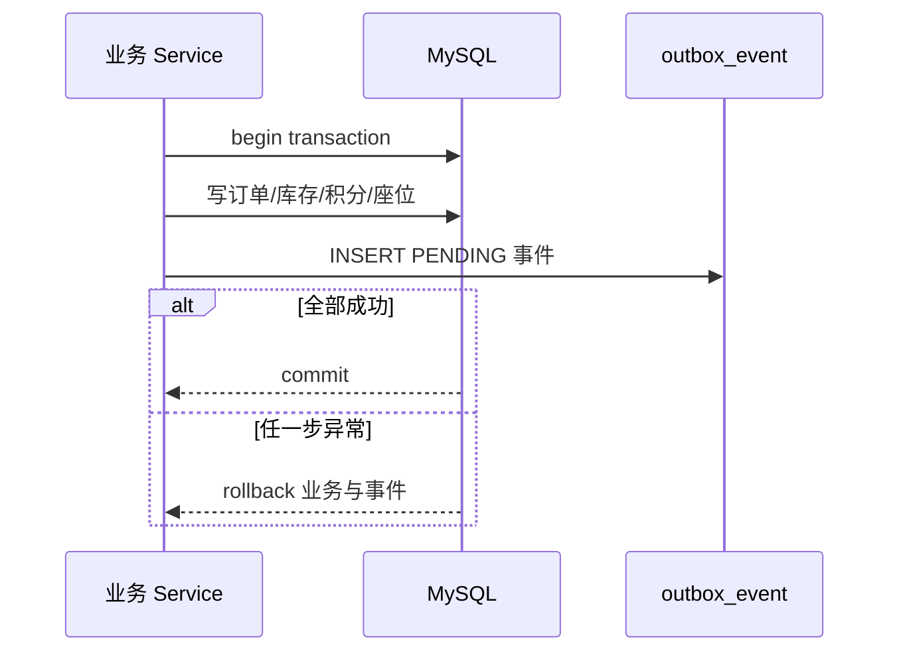
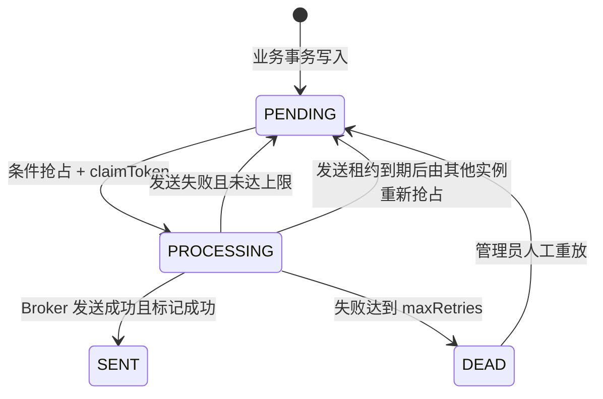
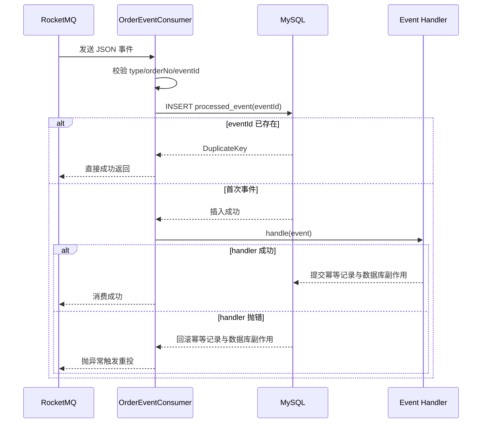

# 07. Outbox 与消息可靠性

## 1. 要解决的双写问题

如果业务代码先提交订单、再直接发送 MQ，会存在两个不可原子化的动作：

```text
MySQL commit 成功
    -> 进程在发送 MQ 前崩溃
    -> 订单存在，但下游永远收不到事件
```

反过来先发 MQ 再提交数据库也不安全：消费者可能看到一条最终回滚的订单事件。

Transactional Outbox 的核心是把“订单数据”和“待发送事件”放入同一个 MySQL 本地事务。事务成功，两者都存在；事务回滚，两者都不存在。向 RocketMQ 的发送改由后台调度器异步完成。

## 2. 角色与职责

| 角色 | 当前实现 | 职责 |
| --- | --- | --- |
| 业务生产方 | `SeatService`、`PaymentService`、`OrderCloseService` | 在业务事务内写 Outbox |
| 可靠性账本 | MySQL `outbox_event` | 保存载荷、状态、重试和抢占租约 |
| 实际发送方 | `OutboxService#pollAndSend` | 抢占事件并同步发送 Broker |
| 消息 Broker | RocketMQ | 保存与投递订单事件 |
| 普通事件消费入口 | `OrderEventConsumer` | 消费订单领域事件 Topic |
| 超时消费入口 | `OrderTimeoutConsumer` | 消费专用 DELAY Topic 的到期检查 |
| 共享处理器 | `OrderEventProcessor` | 解析、幂等登记并路由处理器 |
| 幂等账本 | MySQL `processed_event` | 记录已成功处理的 eventId |
| 事件处理器 | Created/Paid/Cancelled/Timeout Handler | 更新投影或触发统一关单用例 |

生产者和消费者当前在同一个 Spring Boot 部署单元中。MQ 解耦的是事务提交与异步副作用，不意味着当前已经拆成多个微服务。

## 3. 事件类型

| 事件 | 产生时机 | 当前消费者动作 |
| --- | --- | --- |
| `ORDER_CREATED` | 锁座建单事务 | 同步余票查询投影、失效座位图 |
| `ORDER_TIMEOUT_CHECK` | 锁座建单事务，与订单同时写入 | 到绝对截止时间检查订单，仍为待支付才关单 |
| `ORDER_PAID` | 支付事务 | 从数据库重建已售座位投影、失效座位图 |
| `ORDER_CANCELLED` | 用户取消、定时消息、懒过期或扫描兜底 | 同步余票投影、失效座位图、清理残留锁记录 |

`ORDER_TIMEOUT_CHECK` 是一条“到期后重新检查”的命令，不是取消事实。只有数据库条件关单成功后才产生 `ORDER_CANCELLED` 事实事件；`cancel_reason` 和事件 `reason` 区分 `DELAY_MESSAGE`、`PAYMENT_LAZY_EXPIRE`、`DB_SCAN_FALLBACK` 与 `USER_CANCEL`。

## 4. 写入阶段



`writeEvent` 为每条事件生成 UUID `eventId`，把它同时放入 Outbox 列和 JSON envelope。事件载荷至少包含 `type`、`eventId` 与 `orderNo`，并按场景附带用户、场次、座位数、金额或取消原因。

序列化失败会抛出异常，使当前业务事务回滚；系统不会提交一笔无法构造事件的订单。

## 5. 生产端状态机



### 5.1 当前参数

| 参数 | 当前值 |
| --- | --- |
| 扫描周期 | 每次完成后 5 秒再扫描 |
| 单批候选数 | 100 |
| 发送租约 | 默认 30 秒 |
| 单次同步发送超时 | 1000 ms |
| 最大重试次数 | 默认 10 |
| 退避 | `min(300, 2^retry)` 秒 |
| SENT 保留期 | 7 天，之后每日清理 |
| DEAD 查询上限 | 接口最多返回 200 条 |

## 6. 多实例抢占

仅仅 `SELECT PENDING` 不能防止两个实例同时发送。当前实现采用“候选查询 + 条件更新”：

1. 查询到期的 `PENDING`，或发送租约已经到期的 `PROCESSING`。
2. 每个实例为事件生成唯一 `claimToken`。
3. 条件 UPDATE 把事件更新为 `PROCESSING`，同时写 `claimToken` 和 `claimedUntil`。
4. 只有受影响行数为 1 的实例获得发送权。
5. 标记 SENT 或 RETRY 时也必须匹配同一个 `claimToken`。

这与 `SELECT ... FOR UPDATE SKIP LOCKED` 都能实现多实例竞争。当前方案不长时间持有数据库事务锁，代价是需要显式维护租约状态。

## 7. 发送与重试

普通事件调用 RocketMQ 同步发送；`ORDER_TIMEOUT_CHECK` 从载荷读取 `deliverAtEpochMs`，调用 RocketMQ 5 按绝对时间投递，并使用独立的 `guangying_order_timeout` DELAY Topic。收到 Broker 成功返回后才把事件标为 `SENT`。若 Outbox 到截止时间后才恢复，超时检查改为立即发送。失败时：

- `retries + 1`。
- 截断并保存最近一次错误文本。
- 计算下一次重试时间。
- 未达到上限回到 `PENDING`。
- 达到上限进入 `DEAD`，等待人工查看和重放。

同步发送成功只说明 Broker 接受了消息，不代表消费者已经完成业务处理。

专用超时 Topic 不能只依赖 Broker 的自动建 Topic：Docker 初始化任务会显式创建 `message.type=DELAY` 的 Topic，并在完成后才启动后端。数据库扫描仍保留为 Broker 丢消息、长时间不可用或配置错误时的最终补偿。

## 8. 为什么仍会重复发送

考虑这个窗口：

```text
1. RocketMQ 已成功接收消息
2. 应用尚未把 Outbox 标记为 SENT
3. 进程崩溃
4. claim 租约过期，另一个实例再次发送
```

任何只依赖生产端状态的方案都很难消除这个窗口，因此当前语义是 At-least-once：允许重复，尽量不丢。正确性由消费端幂等保证。

“Broker exactly-once”也不能自动让数据库、Redis 和外部通知形成端到端 exactly-once。工程上更可信的表述是“至少一次投递 + 幂等消费 + 可恢复状态”。

## 9. 消费端幂等



先写 `processed_event` 再执行处理器看起来容易“先标记成功”，但两者位于同一个数据库事务：处理器抛异常时，幂等记录一起回滚，下一次投递仍能重新执行。

升级前没有 `eventId` 的旧消息使用 `type:orderNo` 作为稳定兼容键。新事件始终使用 UUID eventId。

## 10. 命令与注册表模式

消费者不维护不断增长的 `if/else`：

```text
OrderEventHandler
  ├── OrderCreatedEventHandler
  ├── OrderPaidEventHandler
  ├── OrderCancelledEventHandler
  └── OrderTimeoutCheckEventHandler

OrderEventHandlerRegistry: eventType -> handler
```

每个 Handler 像一条事件命令，注册表负责路由。新增事件类型时增加 Handler，无需修改消费者核心流程；重复注册同一类型会在启动或测试阶段暴露冲突。

未知事件类型当前会抛出异常并触发重试。生产化时需要配套告警和死信治理，否则错误版本的事件会无意义重试。

## 11. Redis 投影与消费事务

当前处理器主要更新可重建的查询投影：

- 创建事件同步余票数量并失效座位图。
- 支付事件从 MySQL 重建已售集合。
- 取消事件同步余票并清理残留座位锁记录。

Redis 不参与消费者的 MySQL 事务。Redis 更新失败时，MySQL 事件去重记录可能仍提交，但这些投影可以在读取时从权威数据库重建。若未来 Handler 调用不可重建的外部系统，例如短信计费或第三方出票，则必须为该副作用单独设计幂等键、状态表与补偿流程。

## 12. 失败场景矩阵

| 失败点 | 数据状态 | 恢复方式 |
| --- | --- | --- |
| 业务事务写 Outbox 前异常 | 订单和事件都回滚 | 客户端重试 |
| 订单与 Outbox commit 后应用崩溃 | 事件保持 PENDING | 新实例扫描发送 |
| 两实例同时扫描一条事件 | 仅一个 claim UPDATE 成功 | 未抢占实例跳过 |
| 发送过程中实例卡死 | PROCESSING 租约最终过期 | 其他实例重新抢占 |
| RocketMQ 不可用 | PENDING 重试并指数退避 | Broker 恢复后自动补发 |
| 定时消息到期但未消费 | 订单仍为 PENDING | 支付懒过期或 DB 扫描兜底，恢复后重复检查幂等结束 |
| 定时消息过早到达 | 不提前修改订单 | 抛错回滚幂等记录并让 Broker 重投 |
| MQ 成功但 markSent 前崩溃 | 消息可能重复 | 消费端 eventId 去重 |
| 消费者在 Handler 中失败 | 消费事务回滚 | Broker 重投 |
| 重复消息到达 | 唯一键冲突 | 直接跳过，不重复副作用 |
| 连续失败达到上限 | Outbox 进入 DEAD | 管理接口查看、修复后重放 |
| Redis 投影更新失败 | MySQL 事实正确、投影滞后 | 读取时或后续事件从 DB 重建 |

## 13. Outbox 不负责什么

- 不负责让订单事务和消费者事务强一致。
- 不保证全局事件顺序；并发消费时需由业务状态机拒绝非法逆序。
- 不自动保证外部 API 副作用幂等。
- 不替代数据库备份、消息堆积监控和人工运营工具。
- 不把消息当作订单状态权威；超时消费者仍须查询 MySQL，并由状态 CAS 决定能否关单。

## 14. 监控指标建议

生产化至少需要：

- PENDING/PROCESSING/DEAD 数量与最老事件年龄。
- 每分钟发送成功数、失败数和平均重试次数。
- claim 冲突率与过期 PROCESSING 回收数。
- RocketMQ 发送延迟、消费延迟和重试次数。
- 超时消息应到时间与实际消费时间差、DB 兜底扫描关单数和最老过期订单年龄。
- `processed_event` 重复命中数。
- 各事件处理器耗时和失败率。
- DEAD 人工重放结果与审计记录。

“队列表面为空”不代表健康，最老未发送事件年龄通常比瞬时数量更能反映积压。

## 15. 当前边界与改进项

1. 扫描轮询有最多数秒的发送延迟，可用事务提交后轻量唤醒降低平均延迟，同时保留轮询兜底。
2. 发送租约必须大于正常发送 P99；固定 30 秒需要用指标验证。
3. Outbox 表长期增长需要分区、归档或更细的清理策略。
4. 管理端重放应增加操作审计、事件详情脱敏和权限分级。
5. 事件 schema 缺少显式版本号，未来跨服务演进时应加入 `schemaVersion`。
6. 需要以真实 RocketMQ/Testcontainers 补充重复投递、Broker 重启和消费者崩溃测试。

## 16. 关键代码

- [`OutboxService.java`](../backend/service/src/main/java/com/guangying/service/infrastructure/OutboxService.java)
- [`OutboxEventMapper.java`](../backend/dao/src/main/java/com/guangying/dao/mapper/OutboxEventMapper.java)
- [`OrderEventConsumer.java`](../backend/service/src/main/java/com/guangying/service/mq/OrderEventConsumer.java)
- [`OrderTimeoutConsumer.java`](../backend/service/src/main/java/com/guangying/service/mq/OrderTimeoutConsumer.java)
- [`OrderEventProcessor.java`](../backend/service/src/main/java/com/guangying/service/mq/OrderEventProcessor.java)
- [`OrderEventHandlerRegistry.java`](../backend/service/src/main/java/com/guangying/service/mq/handler/OrderEventHandlerRegistry.java)
- [`OrderCreatedEventHandler.java`](../backend/service/src/main/java/com/guangying/service/mq/handler/OrderCreatedEventHandler.java)
- [`OrderPaidEventHandler.java`](../backend/service/src/main/java/com/guangying/service/mq/handler/OrderPaidEventHandler.java)
- [`OrderCancelledEventHandler.java`](../backend/service/src/main/java/com/guangying/service/mq/handler/OrderCancelledEventHandler.java)
- [`OrderTimeoutCheckEventHandler.java`](../backend/service/src/main/java/com/guangying/service/mq/handler/OrderTimeoutCheckEventHandler.java)
- [`OutboxAdminController.java`](../backend/provider/src/main/java/com/guangying/provider/controller/OutboxAdminController.java)

## 17. 面试追问索引

- 为什么订单提交后直接发 MQ 会丢消息？
- Outbox 如何保证多实例不会正常情况下重复发送？
- 为什么有 claimToken 还必须有 claimedUntil？
- MQ 已收到但 Outbox 未标 SENT 怎么办？
- 为什么系统选择 At-least-once，而不是声称 exactly-once？
- `processed_event` 为什么必须和 Handler 数据库操作同事务？
- Redis 副作用无法随消费事务回滚时如何处理？
- Outbox、RocketMQ 和消费者分别承担什么职责？
