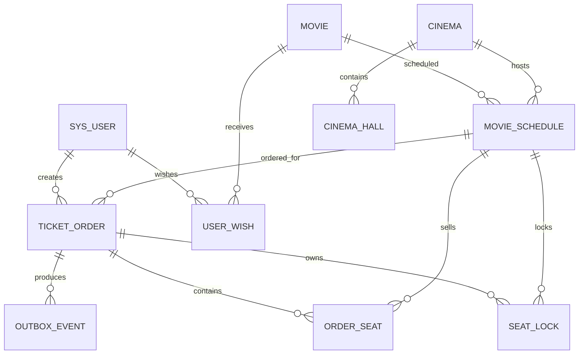

# 08. 数据库设计

## 1. 设计原则

数据库承担两类职责：保存业务权威事实，以及用约束对并发结果做最终裁决。应用层校验用于提前失败和改善用户体验，唯一索引、条件更新和事务才是不能绕过的正确性边界。

当前提供两套兼容结构：

- 本地 H2 使用 [`schema.sql`](../backend/provider/src/main/resources/schema.sql)，以 MySQL 兼容模式启动。
- Docker MySQL 使用 [`00-init.sql`](../docker/mysql/init/00-init.sql)，已有数据卷通过 migrations 增量升级。

## 2. 数据域关系

Outbox 事件通过载荷中的订单号关联业务，不设置数据库外键。当前 Schema 主要依靠应用逻辑和索引约束，没有广泛声明物理外键，便于初始化与演示，但生产系统需要通过对账和数据质量任务弥补孤儿记录风险。

## 3. 核心表

### 3.1 内容与排片

| 表 | 作用 | 关键字段 |
| --- | --- | --- |
| `movie` | 电影内容 | 状态、上映年份、排序、想看数、软删除 |
| `cinema` | 影院信息 | 城市、品牌、行政区、服务标签、软删除 |
| `cinema_hall` | 影厅物理布局 | 行列、过道、情侣座、不可用座位 |
| `movie_schedule` | 可售场次 | 电影、影院、影厅、时间、价格、总座位、可售座位 |

场次表的 `available_seats` 是库存权威汇总。具体某个座位是否已成交由 `order_seat` 和座位唯一约束确认，两者需要通过交易事务保持一致。

### 3.2 用户与订单

| 表 | 作用 | 关键字段 |
| --- | --- | --- |
| `sys_user` | 账号、密码摘要、角色、积分 | `account` 唯一、`role`、`points` |
| `ticket_order` | 订单主表和展示快照 | 订单号、幂等键、指纹、状态、过期时间、取消原因 |
| `seat_lock` | 待支付锁座与购买状态 | 场次、行列、用户、订单、锁到期时间、状态 |
| `order_seat` | 已支付座位明细 | 订单、场次、行列、座位标签 |
| `user_wish` | 用户想看关系 | 用户、电影、创建时间 |

订单冗余电影名、影院名、影厅名、放映时间和价格，是有意保存的交易快照。历史订单不应随着内容表修改而改变当时展示内容。

### 3.3 消息可靠性

| 表 | 作用 | 关键字段 |
| --- | --- | --- |
| `outbox_event` | 生产端可靠投递账本 | eventId、类型、载荷、状态、重试、claim 租约 |
| `processed_event` | 消费端幂等账本 | eventId 主键、事件类型、订单号、处理时间 |

## 4. 关键唯一约束

| 约束 | 防止的问题 |
| --- | --- |
| `sys_user(account)` | 同一账号重复注册 |
| `ticket_order(order_no)` | 订单号重复 |
| `ticket_order(user_id, idempotency_key)` | 同一用户同一购票意图重复建单 |
| `user_wish(user_id, movie_id)` | 重复“想看”记录 |
| `cinema_hall(cinema_id, hall_name, deleted)` | 同一影院重复影厅定义 |
| `seat_lock(schedule_id, row_num, col_num)` | 同一场次同一座位重复锁定 |
| `order_seat(schedule_id, row_num, col_num)` | 同一场次同一座位重复成交 |
| `outbox_event(event_id)` | 生产事件 ID 重复 |
| `processed_event(event_id)` | 消费副作用重复执行 |

分布式锁、Lua 和请求前置查询都可能因为超时、进程崩溃或缓存丢失而失效，唯一约束是并发写入穿透所有前置防线后的最终裁决。

## 5. 查询索引

### 5.1 内容查询

- `movie(movie_status, deleted, sort_order)`：热映/待映列表及排序。
- `movie(release_year, movie_status, deleted)`：按年份和状态筛选。
- `cinema(city_id, deleted, sort_order)`：城市影院列表。
- `movie_schedule(movie_id, show_date, deleted)`：电影维度的日期排片。
- `movie_schedule(cinema_id, show_date, deleted)`：影院维度的日期排片。

### 5.2 交易查询

- `ticket_order(user_id, status, deleted)`：用户订单列表和状态筛选。
- `ticket_order(status, deleted, expire_time, id)`：按状态与截止时间有序分批扫描漏网超时订单。
- `seat_lock(schedule_id, status)`：场次锁座状态。
- `seat_lock(lock_until, status)`：过期锁查询。
- `order_seat(schedule_id)`：重建已售座位投影。

### 5.3 Outbox 查询

- `(status, create_time)`：按状态顺序扫描事件。
- `(status, next_retry_time)`：选择到期重试事件。
- `(status, claimed_until)`：回收发送租约已过期的 PROCESSING 事件。

索引设计必须与真实 SQL 和选择性一起验证。小数据集下“走索引”不等于大数据量下仍高效，应使用 `EXPLAIN`、慢查询日志和实际基数复核。

## 6. 条件更新

### 6.1 库存扣减

库存更新把校验放进同一条 SQL：只有 `available_seats >= seatCount` 才扣减。受影响行数为零即失败，避免“先查库存再更新”之间的竞态窗口。

### 6.2 积分扣减

积分同样采用余额条件更新。即使两个支付请求同时读取到足够积分，也只有满足数据库条件的更新才能成功。

### 6.3 订单状态

支付和取消都要求当前状态为 `PENDING`。状态更新成功的一方获得转换权，另一方根据受影响行数发现状态已经变化。

这种 SQL 层 CAS 比只在 Java 中判断状态更可靠，因为读取和写入之间可能有并发事务。

## 7. 事务边界

| 用例 | 同一事务内的数据 |
| --- | --- |
| 建单 | 库存扣减、`seat_lock`、`ticket_order`、ORDER_CREATED 与 ORDER_TIMEOUT_CHECK Outbox |
| 支付 | 积分扣减、订单 PAID、`order_seat`、锁状态、ORDER_PAID Outbox |
| 取消/超时 | 订单 CANCELLED、库存返还、锁释放、ORDER_CANCELLED Outbox |
| 消费事件 | `processed_event` 与处理器中的数据库副作用 |

Redis 和 RocketMQ 不加入 MySQL 事务，分别通过事务同步回调、TTL、重建、Outbox 和幂等恢复。

## 8. 状态编码

订单状态：

| 值 | 含义 |
| ---: | --- |
| 0 | PENDING / 待支付 |
| 1 | PAID / 已支付 |
| 2 | CANCELLED / 已取消，用户取消与三种超时触发均使用该状态，`cancel_reason` 记录来源 |
| 3 | REFUNDED / 枚举预留 |

座位锁状态：

| 值 | 含义 |
| ---: | --- |
| 0 | 已释放 |
| 1 | 锁定中 |
| 2 | 已购买 |

随着状态复杂度增加，推荐把数字编码、合法迁移和终态规则集中到领域状态机，避免各 Service 分散判断。

## 9. H2 与 MySQL 差异

H2 以 MySQL 兼容模式运行，适合快速测试，但不能证明：

- MySQL 行锁、死锁检测和隔离级别行为完全一致。
- MySQL 优化器在生产数据规模下选择相同执行计划。
- 字符集、排序规则、时间类型和 SQL 方言没有差异。
- Redis/MQ 与真实 MySQL 组合下的故障恢复正确。

因此 H2 测试主要验证业务流程，完整交易与并发验证应使用 Docker MySQL 或 Testcontainers。

## 10. Schema 演进

全新 Docker 数据卷执行初始化脚本。旧数据卷需要按顺序执行 `docker/mysql/migrations` 下的增量脚本，例如幂等键、用户角色和 Outbox 运维索引迁移。

当前迁移主要依赖人工顺序执行，生产化建议接入 Flyway 或 Liquibase：

- 每个变更有不可重复的版本号。
- 应用启动时可校验 Schema 版本。
- CI 能在空库和升级库上验证迁移。
- 破坏性变更采用 expand-and-contract，避免一次发布同时要求新旧代码切换。

## 11. 数据治理与改进

1. 补充物理外键或离线对账，发现订单、座位与场次的孤儿数据。
2. `seat_lock` 已释放记录需要归档或清理策略，否则长期增长影响索引。
3. `processed_event` 需要按消息最长重投周期制定清理策略，不能过早删除。
4. Outbox SENT 当前保留 7 天，生产环境应结合法规、排障周期和存储成本配置。
5. 为订单金额、积分变化增加不可变流水，便于审计与对账。
6. 使用数据库约束保证非负库存和非负积分，防御遗漏条件更新的代码路径。

## 12. 关键代码与脚本

- [`schema.sql`](../backend/provider/src/main/resources/schema.sql)
- [`MySQL 初始化脚本`](../docker/mysql/init/00-init.sql)
- [`数据库迁移目录`](../docker/mysql/migrations)
- [`ScheduleMapper.java`](../backend/dao/src/main/java/com/guangying/dao/mapper/ScheduleMapper.java)
- [`OrderMapper.java`](../backend/dao/src/main/java/com/guangying/dao/mapper/OrderMapper.java)
- [`OutboxEventMapper.java`](../backend/dao/src/main/java/com/guangying/dao/mapper/OutboxEventMapper.java)

## 13. 面试追问索引

- 为什么有 Redis 锁还需要座位唯一索引？
- 为什么库存条件更新比场次版本号更适合不同座位并发？
- 订单为什么冗余电影和影院信息？
- `processed_event` 应该什么时候清理？
- H2 集成测试为什么不能证明 MySQL 并发正确性？
- 没有外键时如何保证数据质量？
