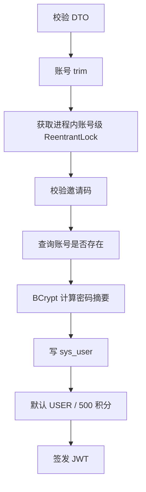
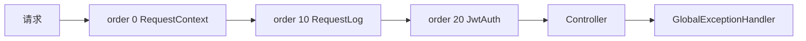

# 09. 认证、安全与接口治理

## 1. 当前安全边界

项目实现的是适合学习和校招展示的轻量认证体系：BCrypt 密码摘要、JWT Access Token、请求拦截器、登录防刷和 USER/ADMIN 两级角色。它不是完整的身份平台，当前没有 Refresh Token、Token 撤销、设备管理、MFA 或完整 RBAC。

## 2. 注册流程



同账号注册使用 `ConcurrentHashMap<account, ReentrantLock>` 合并单实例并发，不影响不同账号。多实例场景下进程锁无法互斥，最终由 `sys_user.account` 唯一约束阻止重复创建。

当前邀请码为服务代码中的固定值 `lpf`，仅适合演示。真实系统应保存摘要或由配置/数据库管理，支持过期时间、使用次数、创建者和审计，不能把邀请码明文硬编码到仓库。

## 3. 登录责任链

```text
order 10：参数兜底、账号去空格
order 20：按账号滑动窗口限流，60 秒最多 10 次
order 30：查询未删除用户
order 40：BCrypt 校验密码
```

Spring 自动收集所有 `LoginHandler` 并按 `order` 排序。启动时拒绝重复顺序值，任何节点抛异常都会中断后续链路。

责任链的价值是把变化点分开：未来可增加账号冻结、验证码、风险设备或异地登录节点，而无需把登录方法扩展成巨大的条件分支。

### 3.1 当前信息泄露边界

用户不存在返回“账号不存在”，密码错误返回“密码错误”，对演示友好但会帮助攻击者枚举账号。生产环境应统一对外提示“账号或密码错误”，详细原因只进入安全日志。

### 3.2 登录限流边界

当前按账号限流可阻止单账号暴力尝试，但攻击者可轮换账号或 IP。Redis 故障时限流 fail-open。生产化应组合账号、IP、设备指纹、全局阈值和渐进延迟，并增加本地降级限流。

## 4. 密码处理

密码通过 Spring Security 的 `BCryptPasswordEncoder` 保存。BCrypt 每次编码包含随机盐，数据库不保存明文，也不能通过比较摘要字符串判断两个密码是否相同。

需要明确的边界：

- 日志和异常中不能打印原始密码。
- BCrypt 参数应根据目标机器基准定期调整。
- 修改密码后，当前 JWT 不会自动失效。
- 项目没有找回密码、密码历史、泄露密码库检查和 MFA。

## 5. JWT 模型

Token 包含：

- `sub`：用户 ID。
- `account`：账号。
- `iat`：签发时间。
- `exp`：过期时间，当前默认 72 小时。
- HMAC 签名：密钥由 `JWT_SECRET` 提供。

客户端在 `Authorization: Bearer <token>` 中携带 Token。拦截器验证签名和过期时间后，把 `userId` 放入 request attribute，后续 Controller 不从请求参数相信用户 ID。

### 5.1 当前限制

- 只有 Access Token，没有 Refresh Token 轮换。
- 没有 `jti` 黑名单，用户退出只是删除浏览器本地状态。
- 角色没有写入 Token；管理接口每次查询数据库角色，这反而能及时反映管理员撤权。
- 前端通过 Zustand persist 把 Token 放在 localStorage，存在 XSS 窃取风险。

生产 Web 场景可考虑短期 Access Token + HttpOnly/Secure/SameSite Refresh Cookie，并配套 CSRF 策略、刷新轮换和撤销记录。

## 6. 请求拦截链



### 6.1 Request Context

接受格式安全、最长 64 字符的 `X-Request-Id`，否则生成 UUID。ID 同时写入请求属性、响应头和 MDC，请求结束后从 MDC 清理，便于关联日志且避免线程复用污染。

### 6.2 请求日志

记录方法、URI、HTTP 状态和耗时；超过 1000 ms 额外输出慢请求警告。当前是日志级观测，不等价于指标、Tracing 或告警系统。

### 6.3 JWT 鉴权

保护订单、锁座、支付、排队、管理和想看写接口。座位布局和想看状态检查允许匿名访问。OPTIONS 预检直接放行。

## 7. 授权模型

当前只有：

- `USER`：普通注册用户。
- `ADMIN`：可初始化热门场次、查看或重试 DEAD Outbox。

管理接口先经过 JWT，再由 `UserService#requireAdmin` 查询数据库确认角色。权限不是只靠前端隐藏按钮，后端仍做最终校验。

当前没有资源级权限、角色权限表和操作审计。如果扩展运营后台，可引入 RBAC：用户—角色—权限关系、接口或资源权限、审计事件和最小权限原则。

## 8. 交易接口安全

认证只是第一层，交易接口还使用：

- 锁座请求 DTO 校验和最多 6 座限制。
- userId 取自 JWT 上下文，支付/取消查询同时绑定订单号和 userId。
- 客户端幂等键格式限制与 SHA-256 请求指纹。
- AOP 用户级令牌桶。
- Waiting Room 入场令牌。
- 数据库状态条件更新和唯一约束。

这些机制分别防止越权、重复提交、接口刷取和并发冲突，不能由单一 JWT 替代。

## 9. 配置与秘密

Docker Compose 要求从 `.env` 提供 MySQL 密码和 `JWT_SECRET`。仓库中的 `.env.example` 只提供占位符，真实 `.env` 不应提交。

生产环境建议：

- 使用 Secret Manager 或容器 Secret，不把秘密写入镜像和日志。
- 启动时拒绝默认 JWT 密钥，而不是允许占位值。
- 定期轮换密钥，并支持多把验证密钥的过渡期。
- 数据库使用最小权限账号，应用账号不能执行 DDL 或授予权限。

## 10. Web 安全检查表

| 风险 | 当前情况 | 演进建议 |
| --- | --- | --- |
| XSS 盗取 Token | Token 在 localStorage | CSP、输出转义、依赖扫描，考虑 HttpOnly Cookie |
| CSRF | Bearer Header 模型风险较低 | 若改 Cookie，必须加入 SameSite/CSRF Token |
| 账号枚举 | 错误提示可区分 | 统一登录失败文案 |
| 暴力登录 | 单账号 10/min | 组合 IP/设备/账号，失败递增延迟 |
| 邀请码泄漏 | 代码硬编码 | 数据化、摘要、过期和次数限制 |
| Token 撤销 | 未实现 | jti/会话版本/黑名单 |
| 管理审计 | 未完整实现 | 记录操作者、请求 ID、前后值和结果 |
| 默认密钥 | 本地存在默认值 | 非本地 profile 启动强校验 |
| 依赖漏洞 | CI 未见安全扫描 | Dependabot/SCA、镜像扫描 |

## 11. 关键代码

- [`UserService.java`](../backend/service/src/main/java/com/guangying/service/UserService.java)
- [`LoginValidationChain.java`](../backend/service/src/main/java/com/guangying/service/auth/LoginValidationChain.java)
- [`登录 Handler 目录`](../backend/service/src/main/java/com/guangying/service/auth/handler)
- [`JwtUtil.java`](../backend/common/src/main/java/com/guangying/common/utils/JwtUtil.java)
- [`JwtAuthInterceptor.java`](../backend/provider/src/main/java/com/guangying/provider/interceptor/JwtAuthInterceptor.java)
- [`WebMvcConfig.java`](../backend/provider/src/main/java/com/guangying/provider/config/WebMvcConfig.java)
- [`user.ts`](../frontend/src/store/user.ts)

## 12. 面试追问索引

- 为什么密码使用 BCrypt，而不是 SHA-256？
- JWT 无状态的代价是什么，如何强制退出？
- 登录责任链相比一个 Service 方法有什么收益？
- 为什么注册进程锁不能解决多实例并发？
- 管理员角色为什么不只相信 JWT claim？
- localStorage 和 HttpOnly Cookie 各有什么安全取舍？
- Redis 故障时登录限流放行是否合理？
