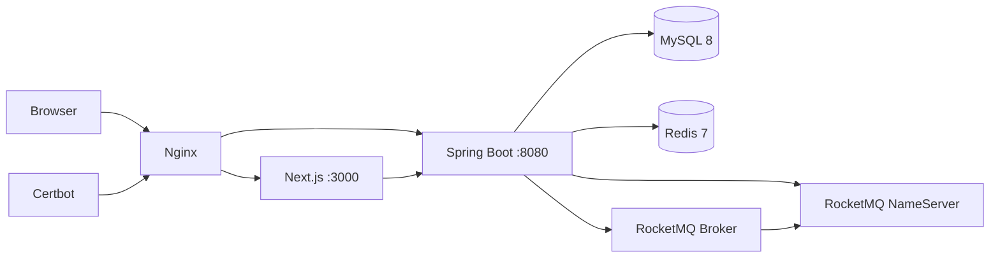

# 10. 部署与运行手册

## 1. 两种运行模式

| 模式 | 依赖 | 适用场景 | 不验证的能力 |
| --- | --- | --- | --- |
| 本地默认 | Java 17、Node.js；H2 内嵌 | 快速浏览、开发、基础集成测试 | Redis 分布式锁、真实排队、RocketMQ 投递、MySQL 行为 |
| Docker 完整 | Docker Compose | 全链路演示和中间件验证 | 多节点高可用、真实生产容量 |

## 2. 本地快速启动

### 2.1 后端

```powershell
cd backend
.\mvnw.cmd -pl provider -am spring-boot:run
```

后端默认监听 `http://localhost:8080`。H2 控制台：

```text
URL:      http://localhost:8080/h2-console
JDBC URL: jdbc:h2:mem:guangying
User:     sa
Password: 空
```

默认配置排除了 Redis、Redis Repository 和 Redisson 自动配置，RocketMQ 未配置 NameServer 时消费者不启动。

### 2.2 前端

```powershell
cd frontend
npm install
npm run dev
```

访问 `http://localhost:3000`。Next.js rewrites 把 `/ajax`、`/api` 和 `/dianying` 请求代理到后端 8080。

## 3. Docker 完整启动

### 3.1 准备秘密

```powershell
Copy-Item .env.example .env
```

至少替换：

- `MYSQL_ROOT_PASSWORD`
- `MYSQL_PASSWORD`
- `JWT_SECRET`，使用长度足够的随机值

不要提交真实 `.env`。

### 3.2 配置校验

```powershell
docker compose config
```

该命令会展开环境变量并校验 Compose 结构。检查输出时不要把包含真实秘密的内容粘贴到公共日志。

### 3.3 启动

```powershell
docker compose up -d --build
docker compose ps
```

默认入口：

- Nginx：`http://localhost`
- MySQL：仅绑定 `127.0.0.1:3306`
- RocketMQ NameServer：`9876`
- RocketMQ Broker：`10909/10911`
- Backend/Frontend：在 Compose 网络中由 Nginx 访问

### 3.4 查看日志

```powershell
docker compose logs -f backend
docker compose logs -f mysql redis rocketmq-broker
```

### 3.5 停止

```powershell
docker compose stop
```

`stop` 保留容器和数据卷。只有明确需要清空演示数据时才使用 `down -v`；该操作会删除 MySQL、Redis、RocketMQ 和证书相关卷，执行前必须备份。

## 4. Compose 拓扑



所有服务位于 `guangying-net` bridge 网络。MySQL、Redis 和应用数据使用命名卷持久化。

## 5. 资源配置

当前 Compose 针对约 2 GB 内存服务器做了演示级限制：

| 服务 | 内存上限 |
| --- | ---: |
| MySQL | 350 MB |
| Redis | 64 MB，最大数据内存 48 MB，allkeys-lru |
| RocketMQ NameServer | 256 MB |
| RocketMQ Broker | 512 MB |
| Backend | 350 MB |
| Frontend | 128 MB |
| Nginx | 32 MB |

这些参数用于低成本演示，不是生产推荐值。RocketMQ、MySQL buffer pool、连接池和 JVM GC 应根据真实流量与数据规模重新容量评估。

## 6. 配置矩阵

| 配置 | 本地默认 | Docker |
| --- | --- | --- |
| Spring Profile | default | docker |
| 数据库 | H2 内存 | MySQL 8 |
| Schema 初始化 | 每次启动 | 首次创建数据卷时执行 init |
| Redis | 自动配置排除 | Lettuce + Redisson 启用 |
| RocketMQ | 不启用 | NameServer/Broker 启用 |
| 超时关单 | 支付懒过期 + H2 扫描兜底 | DELAY Topic 主触发 + 懒过期 + MySQL 扫描兜底 |
| 热门场次默认活跃准入 | 2000 | `QUEUE_DEFAULT_MAX_ADMISSION` |
| 队列等待上限 | 100000 | `QUEUE_MAX_WAITING` |
| JWT 过期 | 72 小时 | 72 小时 |

## 7. 数据库升级

全新数据卷会执行最新初始化脚本。旧数据卷不会重新执行 init，需要备份后按顺序执行 [`docker/mysql/migrations`](../docker/mysql/migrations) 中的迁移。

当前需要关注的增量包括：

- 建单幂等键与请求指纹。
- 用户 `role` 字段。
- Outbox 重试、抢占和运维索引。
- 订单 `cancel_reason` 与 `(status, deleted, expire_time, id)` 超时扫描索引。

执行迁移前先确认目标数据库和备份可恢复性。生产化建议使用 Flyway/Liquibase 自动记录版本。

## 8. 启动后验证

建议按从底层到业务的顺序：

1. `docker compose ps -a` 确认 `rocketmq-init` 成功退出，MySQL、Redis、RocketMQ、后端、前端、Nginx 运行。
2. 后端日志确认 datasource、Redis、RocketMQ 初始化成功，并确认 `guangying_order_timeout` 已创建为 DELAY Topic。
3. 打开首页验证电影列表和影院查询。
4. 注册/登录后查询 `/api/auth/me`。
5. 对一个普通场次完成锁座、建单和积分支付。
6. 由管理员初始化热门场次，验证排队位置、准入和离场。
7. 查询数据库确认订单、座位、Outbox 和 processed_event。
8. 创建短过期测试订单，确认超时检查按时到达、订单只关闭一次且 `cancel_reason=DELAY_MESSAGE`。
9. 暂停 Broker 后创建订单，恢复 Broker 后确认 PENDING 超时事件补发；再模拟漏消息，确认 DB 扫描以 `DB_SCAN_FALLBACK` 收敛。

## 9. 常见故障

| 现象 | 优先检查 |
| --- | --- |
| 后端启动时报数据库连接失败 | `.env` 密码、MySQL health、网络名、旧卷账号 |
| Redis 连接超时 | Redis health、`REDIS_HOST`、内存淘汰、网络 |
| Outbox 一直 PENDING | NameServer/Broker、`ROCKETMQ_NAMESRV`、发送错误字段 |
| 超时事件发送失败或立即消费 | `rocketmq-init` 是否成功、Topic 是否为 DELAY 类型、Broker timer wheel、应用与 Broker 时钟 |
| 前端 502 | backend/frontend 容器状态、Nginx upstream、启动顺序 |
| JWT 全部无效 | 多实例 `JWT_SECRET` 是否一致、系统时间、密钥是否更换 |
| 热门场次不排队 | 是否调用 init-hot、热门 key 是否 24h 到期、Redis 是否启用 |
| 支付后座位图短暂不更新 | afterCommit Redis 日志、ORDER_PAID 消费、DB 投影重建 |
| 旧数据卷缺列 | 是否执行 migrations，不要只重建应用镜像 |

## 10. TLS 说明

Compose 包含 Nginx 和 Certbot 卷，但示例域名必须替换，证书首次签发流程仍需结合实际 DNS 和服务器端口配置完成。不能仅凭 `certbot renew` 容器存在就认为 HTTPS 已可用。

## 11. 生产化差距

- 数据库、Redis 和 RocketMQ 当前均是单节点演示拓扑。
- 未提供 Kubernetes、滚动发布、就绪探针和自动扩缩容。
- 缺少 Prometheus 指标、集中日志、Tracing 和告警。
- 秘密仍通过环境文件注入，未接 Secret Manager。
- Schema 迁移未自动化。
- 备份、恢复演练和 RPO/RTO 尚未形成制度。

## 12. 关键文件

- [`docker-compose.yml`](../docker-compose.yml)
- [`.env.example`](../.env.example)
- [`application.yml`](../backend/provider/src/main/resources/application.yml)
- [`backend/Dockerfile`](../backend/Dockerfile)
- [`frontend/Dockerfile`](../frontend/Dockerfile)
- [`Nginx 配置目录`](../docker/nginx)
- [`RocketMQ Broker 配置`](../docker/rocketmq/broker.conf)

## 13. 面试追问索引

- 为什么默认使用 H2，如何说明它的验证边界？
- Docker depends_on 是否等价于应用完全就绪？
- Redis 使用 allkeys-lru 会对排队和锁座 key 带来什么风险？
- 为什么生产中不能照搬 2 GB 演示参数？
- 多实例部署前还要验证哪些共享状态？
